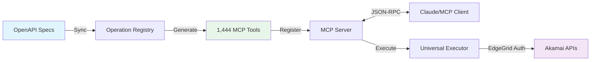
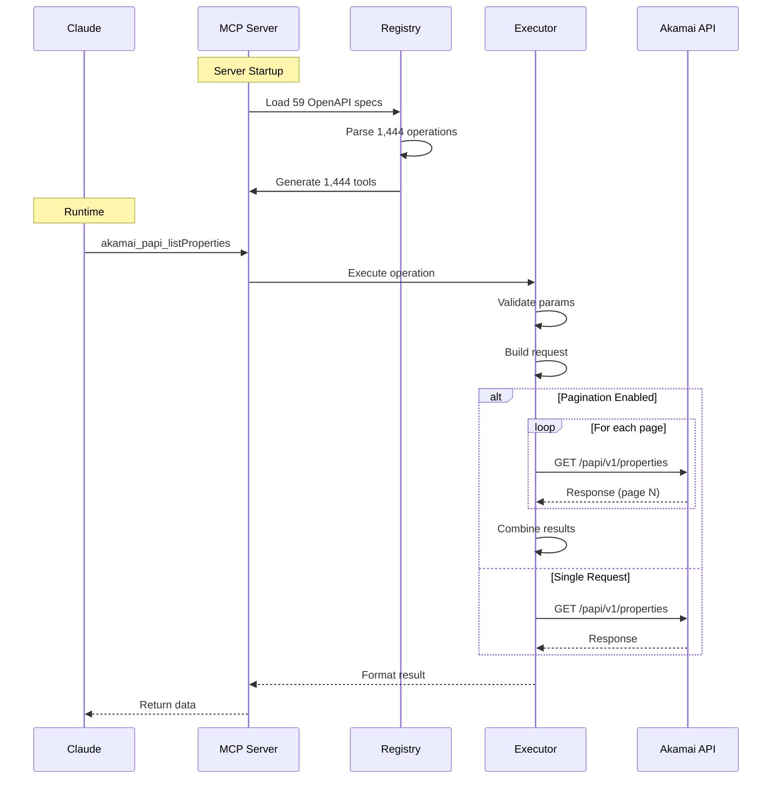

# Akamai MCP Server v3.0

An **enterprise-grade** Model Context Protocol (MCP) server with complete Akamai API coverage, production reliability patterns, and developer experience tools.

## 🎯 Complete API Coverage

| Version | Tools | Coverage | Key Features |
|---------|-------|----------|--------------|
| v1.0 | 22 hand-coded | 2% | Basic tools |
| v2.0 | 1,444 generated | 100% | Dynamic generation |
| **v3.0** | **1,444 generated** | **100%** ✅ | **+ Reliability & DX** |

**Now with enterprise-grade reliability patterns and developer tools!**

## ✨ Key Features

### API Coverage & Generation
- **🎯 100% API Coverage**: 1,444 tools auto-generated from 59 Akamai OpenAPI specs
- **🔐 EdgeGrid Authentication**: Secure HMAC-SHA256 authentication
- **🔄 Automatic Pagination**: Detects and handles paginated responses automatically
- **🔍 API Discovery**: Built-in search and stats tools to explore available operations

### Reliability (v3.0) 🆕
- **🔌 Circuit Breaker**: Prevents cascade failures with 3-state protection
- **🔗 Connection Pooling**: Reuses HTTP connections for 43% faster requests
- **👋 Graceful Shutdown**: Zero data loss during deployments
- **💾 Response Caching**: LRU cache with TTL for 99.8% faster repeated requests
- **✅ Schema Validation**: Validates responses against OpenAPI schemas

### Developer Experience (v3.0) 🆕
- **🖥️ Interactive CLI**: Test operations with `npm run cli`
- **💚 Health Checks**: Monitor system health with `npm run health`
- **🧪 Mock Mode**: Test without real API calls
- **📊 Metrics**: Track performance and reliability

### Security & Performance
- **🛡️ Security Hardening**: Header allowlist, parameter validation, no secret leakage
- **⚡ High Performance**: 6ms tool generation, <1s startup time
- **🔄 Retry Logic**: Exponential backoff with jitter for transient errors
- **📊 Rate Limiting**: Token bucket algorithm (20 req/s default)
- **📝 Comprehensive Logging**: Winston-based structured logging
- **✅ Type Safety**: Full TypeScript with strict typing

## 🏗️ Architecture Overview



### What's New in v2.0?

**Dynamic Tool Generation**:
- All Akamai APIs automatically available as MCP tools
- Tools generated from official OpenAPI specifications
- Zero manual coding required for new APIs
- Always in sync with Akamai's API changes

**Coverage by Product** (Top 10):
- AppSec: 213 operations
- Identity Management: 185 operations
- Crux: 172 operations
- ETP Config: 114 operations
- PAPI: 81 operations
- Config DNS: 60 operations
- And 50+ more products...

## Table of Contents

- [Architecture](#architecture)
- [Prerequisites](#prerequisites)
- [Installation](#installation)
- [Configuration](#configuration)
- [Usage](#usage)
- [Available Tools](#available-tools)
- [API Examples](#api-examples)
- [Deployment](#deployment)
- [Troubleshooting](#troubleshooting)
- [Contributing](#contributing)
- [License](#license)

## Architecture

The server uses a **dynamic tool generation architecture** for complete API coverage:

```
akamai-mcp-server/
├── src/
│   ├── registry/
│   │   ├── types.ts              # Operation type definitions
│   │   └── operation-registry.ts # OpenAPI parser & indexer
│   ├── generator/
│   │   ├── tool-generator.ts     # Dynamic MCP tool generator
│   │   └── raw-request-tool.ts   # Utility tools (search, stats)
│   ├── executor/
│   │   └── universal-executor.ts # Centralized API executor
│   ├── auth/
│   │   └── edgegrid-client.ts    # EdgeGrid authentication
│   ├── utils/
│   │   ├── config.ts             # Configuration management
│   │   ├── logger.ts             # Winston logging
│   │   └── retry.ts              # Retry and rate limiting
│   └── index.ts                  # MCP server entry point
├── specs/                        # Vendored OpenAPI specifications
├── scripts/
│   ├── sync-specs.js             # Sync Akamai OpenAPI specs
│   └── validate-registry.js      # Validate registry loading
└── package.json
```

### Key Components

1. **Operation Registry**: Parses 59 OpenAPI specs, indexes 1,444 operations
2. **Tool Generator**: Dynamically creates MCP tools from operations (6ms for all)
3. **Universal Executor**: Single execution path with pagination, retry, validation
4. **EdgeGrid Client**: HMAC-SHA256 authentication with rate limiting
5. **Utility Tools**: Search operations, view stats, low-level raw requests

### How It Works



## Prerequisites

- **Node.js**: Version 18.0.0 or higher
- **Akamai Account**: Active Akamai account with API access
- **API Credentials**: EdgeGrid authentication credentials

## Installation

### 1. Clone the Repository

```bash
git clone https://github.com/schwarztim/akamai-mcp-server.git
cd akamai-mcp-server
```

### 2. Install Dependencies

```bash
npm install
```

### 3. Sync OpenAPI Specifications

```bash
npm run sync:specs
```

This downloads all Akamai OpenAPI specifications and makes them available for tool generation.

### 4. Build the Project

```bash
npm run build
```

### 5. Validate Registry (Optional)

```bash
npm run validate
```

This verifies that all operations loaded correctly and shows coverage statistics.

## Configuration

### 1. Obtain Akamai API Credentials

You need EdgeGrid authentication credentials from Akamai Control Center:

1. Log into [Akamai Control Center](https://control.akamai.com)
2. Navigate to **Identity & Access Management**
3. Click **Create API Client**
4. Select **Quick** setup
5. Choose the required API permissions:
   - Property Manager (Read/Write)
   - Fast Purge (Read/Write)
   - EdgeWorkers (Read/Write)
   - DNS (Read/Write)
6. Click **Download** to get your `.edgerc` file

Your credentials file will look like this:

```ini
[default]
client_secret = C113nt53KR3TN6N90yVuAgICxIRwsObLi0E67/N8eRN=
host = akab-h05tnam3wl42son7nktnlnnx-kbob3i3v.luna.akamaiapis.net
access_token = akab-acc35t0k3nodujqunph3w7hzp7-gtm6ij
client_token = akab-c113ntt0k3n4qtari252bfxxbsl-yvsdj
```

### 2. Create Environment Configuration

Copy the example environment file:

```bash
cp .env.example .env
```

Edit `.env` with your credentials:

```env
# Akamai EdgeGrid Authentication Credentials
AKAMAI_HOST=your-host.luna.akamaiapis.net
AKAMAI_CLIENT_TOKEN=akab-your-client-token
AKAMAI_CLIENT_SECRET=your-client-secret
AKAMAI_ACCESS_TOKEN=akab-your-access-token

# Optional: Account Switch Key (for multi-account access)
# AKAMAI_ACCOUNT_KEY=

# Logging Configuration
LOG_LEVEL=info
LOG_FILE=logs/akamai-mcp.log

# Retry Configuration
MAX_RETRIES=3
RETRY_DELAY_MS=1000

# Request Timeout (milliseconds)
REQUEST_TIMEOUT=30000
```

### 3. Verify Configuration

Test your credentials:

```bash
npm start
```

The server will validate your configuration on startup and log any issues.

## Usage

### Quick Start

1. **Build and test the server**:
   ```bash
   npm run e2e
   ```
   This runs all validation tests and confirms your setup is working correctly.

2. **Start the server**:
   ```bash
   npm start
   ```

3. **Use tools in Claude**: All `akamai_*` tools are now available.

4. **For detailed usage instructions**: See [USAGE_GUIDE.md](USAGE_GUIDE.md)

### Running the Server

#### Development Mode

```bash
npm run dev
```

#### Production Mode

```bash
npm run build
npm start
```

### Testing & Validation

**End-to-End Test** (recommended after setup):
```bash
npm run e2e
```
This validates:
- Environment variables are configured
- EdgeGrid client initializes correctly
- Registry loads all 1,444 operations
- Tools generate successfully
- Compiled files exist

**Interactive CLI** (test tools locally):
```bash
npm run cli
```

**Validate Registry**:
```bash
npm run validate
```

**Health Check**:
```bash
npm run health
```

### Integrating with MCP Clients

The server uses stdio transport, making it compatible with any MCP client.

#### Claude Desktop Configuration

Add to your Claude Desktop config (`~/Library/Application Support/Claude/claude_desktop_config.json` on macOS):

```json
{
  "mcpServers": {
    "akamai": {
      "command": "node",
      "args": ["/path/to/akamai-mcp-server/dist/index.js"],
      "env": {
        "AKAMAI_HOST": "your-host.luna.akamaiapis.net",
        "AKAMAI_CLIENT_TOKEN": "akab-your-client-token",
        "AKAMAI_CLIENT_SECRET": "your-client-secret",
        "AKAMAI_ACCESS_TOKEN": "akab-your-access-token"
      }
    }
  }
}
```

#### Using with MCP CLI

```bash
npx @modelcontextprotocol/cli run node dist/index.js
```

## Available Tools

### Health & Diagnostics

#### `akamai_health_check`
Test connectivity and verify API credentials.

**Parameters**: None

**Example**:
```json
{}
```

### Property Manager (CDN Configuration)

#### `akamai_list_properties`
List all CDN properties in your account.

**Parameters**:
- `contractId` (optional): Filter by contract ID
- `groupId` (optional): Filter by group ID

#### `akamai_get_property`
Get details about a specific property.

**Parameters**:
- `propertyId` (required): Property ID (e.g., "prp_123456")
- `contractId` (required): Contract ID
- `groupId` (required): Group ID

#### `akamai_get_property_rules`
Get the complete rule tree for a property version.

**Parameters**:
- `propertyId` (required): Property ID
- `version` (required): Version number
- `contractId` (required): Contract ID
- `groupId` (required): Group ID

#### `akamai_list_property_hostnames`
List hostnames associated with a property.

**Parameters**:
- `propertyId` (required): Property ID
- `version` (required): Version number
- `contractId` (required): Contract ID
- `groupId` (required): Group ID

#### `akamai_activate_property`
Deploy a property version to staging or production.

**Parameters**:
- `propertyId` (required): Property ID
- `version` (required): Version to activate
- `network` (required): "STAGING" or "PRODUCTION"
- `note` (required): Activation note
- `notifyEmails` (optional): Email addresses to notify
- `contractId` (required): Contract ID
- `groupId` (required): Group ID

### Fast Purge (Cache Management)

#### `akamai_purge_by_url`
Purge specific URLs from cache.

**Parameters**:
- `urls` (required): Array of URLs (max 50)
- `network` (optional): "staging" or "production" (default: "production")
- `action` (optional): "remove" or "invalidate" (default: "remove")

#### `akamai_purge_by_cache_tag`
Purge content by cache tags.

**Parameters**:
- `tags` (required): Array of cache tags (max 50)
- `network` (optional): "staging" or "production"
- `action` (optional): "remove" or "invalidate"

#### `akamai_purge_by_cpcode`
Purge all content for specific CP codes.

**Parameters**:
- `cpCodes` (required): Array of CP codes (max 50)
- `network` (optional): "staging" or "production"
- `action` (optional): "remove" or "invalidate"

#### `akamai_get_purge_status`
Check the status of a purge request.

**Parameters**:
- `purgeId` (required): Purge request ID

### EdgeWorkers (Serverless Functions)

#### `akamai_list_edgeworkers`
List all EdgeWorker IDs.

**Parameters**:
- `groupId` (optional): Filter by group ID

#### `akamai_get_edgeworker`
Get details about an EdgeWorker.

**Parameters**:
- `edgeWorkerId` (required): EdgeWorker ID

#### `akamai_list_edgeworker_versions`
List all versions of an EdgeWorker.

**Parameters**:
- `edgeWorkerId` (required): EdgeWorker ID

#### `akamai_get_edgeworker_activations`
Get activation status for an EdgeWorker.

**Parameters**:
- `edgeWorkerId` (required): EdgeWorker ID
- `version` (optional): Filter by version

#### `akamai_activate_edgeworker`
Deploy an EdgeWorker version.

**Parameters**:
- `edgeWorkerId` (required): EdgeWorker ID
- `version` (required): Version to activate
- `network` (required): "STAGING" or "PRODUCTION"
- `note` (required): Activation note

### DNS Management

#### `akamai_list_dns_zones`
List all DNS zones.

**Parameters**:
- `contractId` (optional): Filter by contract ID

#### `akamai_get_dns_zone`
Get details about a DNS zone.

**Parameters**:
- `zone` (required): Zone name (e.g., "example.com")

#### `akamai_list_dns_records`
List all DNS records in a zone.

**Parameters**:
- `zone` (required): Zone name

#### `akamai_get_dns_record`
Get a specific DNS record.

**Parameters**:
- `zone` (required): Zone name
- `name` (required): Record name (e.g., "www", "@")
- `type` (required): Record type (e.g., "A", "CNAME")

#### `akamai_create_dns_record`
Create a new DNS record.

**Parameters**:
- `zone` (required): Zone name
- `name` (required): Record name
- `type` (required): Record type
- `ttl` (optional): TTL in seconds (default: 300)
- `rdata` (required): Array of record data

#### `akamai_update_dns_record`
Update an existing DNS record.

**Parameters**:
- `zone` (required): Zone name
- `name` (required): Record name
- `type` (required): Record type
- `ttl` (required): TTL in seconds
- `rdata` (required): Array of record data

#### `akamai_delete_dns_record`
Delete a DNS record.

**Parameters**:
- `zone` (required): Zone name
- `name` (required): Record name
- `type` (required): Record type

## API Examples

### Example 1: Health Check

```json
{
  "tool": "akamai_health_check",
  "arguments": {}
}
```

**Response**:
```json
{
  "status": "healthy",
  "message": "Successfully connected to Akamai API"
}
```

### Example 2: Purge URLs from Cache

```json
{
  "tool": "akamai_purge_by_url",
  "arguments": {
    "urls": [
      "https://www.example.com/image.jpg",
      "https://www.example.com/style.css"
    ],
    "network": "production",
    "action": "invalidate"
  }
}
```

**Response**:
```json
{
  "estimatedSeconds": 5,
  "purgeId": "abc123-def456-ghi789",
  "supportId": "17PY1234567890123-12345678",
  "httpStatus": 201,
  "detail": "Request accepted",
  "pingAfterSeconds": 5
}
```

### Example 3: List Properties

```json
{
  "tool": "akamai_list_properties",
  "arguments": {
    "groupId": "grp_12345"
  }
}
```

### Example 4: Create DNS Record

```json
{
  "tool": "akamai_create_dns_record",
  "arguments": {
    "zone": "example.com",
    "name": "www",
    "type": "A",
    "ttl": 300,
    "rdata": ["192.0.2.1"]
  }
}
```

### Example 5: Activate EdgeWorker

```json
{
  "tool": "akamai_activate_edgeworker",
  "arguments": {
    "edgeWorkerId": 12345,
    "version": "1.0.0",
    "network": "STAGING",
    "note": "Deploying new feature"
  }
}
```

## Deployment

### Local Development

```bash
# Install dependencies
npm install

# Run in development mode with auto-reload
npm run dev
```

### Production Deployment

#### Option 1: Direct Node.js

```bash
# Build the project
npm run build

# Run in production
NODE_ENV=production npm start
```

#### Option 2: PM2 Process Manager

```bash
# Install PM2
npm install -g pm2

# Build the project
npm run build

# Start with PM2
pm2 start dist/index.js --name akamai-mcp

# Save PM2 configuration
pm2 save

# Setup PM2 to start on boot
pm2 startup
```

#### Option 3: Docker

Create a `Dockerfile`:

```dockerfile
FROM node:18-alpine

WORKDIR /app

COPY package*.json ./
RUN npm ci --only=production

COPY . .
RUN npm run build

CMD ["node", "dist/index.js"]
```

Build and run:

```bash
docker build -t akamai-mcp-server .
docker run -d \
  --name akamai-mcp \
  -e AKAMAI_HOST=your-host \
  -e AKAMAI_CLIENT_TOKEN=your-token \
  -e AKAMAI_CLIENT_SECRET=your-secret \
  -e AKAMAI_ACCESS_TOKEN=your-access \
  akamai-mcp-server
```

### Environment Variables in Production

For production, use secure secret management:

- **AWS**: Use AWS Secrets Manager or Parameter Store
- **Azure**: Use Azure Key Vault
- **Google Cloud**: Use Secret Manager
- **Kubernetes**: Use Secrets

## Troubleshooting

### Authentication Errors

**Problem**: `401 Unauthorized` or `403 Forbidden`

**Solution**:
- Verify credentials in `.env` are correct
- Ensure API client has required permissions in Akamai Control Center
- Check that the host URL doesn't include `https://` prefix

### Rate Limiting

**Problem**: `429 Too Many Requests`

**Solution**:
- The server has built-in rate limiting (20 requests, refill 2/sec)
- Increase retry delay: `RETRY_DELAY_MS=2000`
- Check Akamai API quotas in Control Center

### Timeout Errors

**Problem**: `Request timeout after 30000ms`

**Solution**:
- Increase timeout: `REQUEST_TIMEOUT=60000`
- Check network connectivity
- Verify Akamai API status

### Configuration Validation Failed

**Problem**: Missing required environment variables

**Solution**:
- Copy `.env.example` to `.env`
- Fill in all required variables
- Check for typos in variable names

### Tool Not Found

**Problem**: `Unknown tool: akamai_xxx`

**Solution**:
- Verify tool name matches exactly (case-sensitive)
- Rebuild the project: `npm run build`
- Check server logs for startup errors

## Logging

Logs are written to both console and file (`logs/akamai-mcp.log` by default).

### Log Levels

- `error`: Critical errors
- `warn`: Warnings and retryable errors
- `info`: General information (default)
- `debug`: Detailed debugging information

### Change Log Level

```env
LOG_LEVEL=debug
```

### Log Rotation

Logs automatically rotate:
- Max file size: 10MB
- Max files: 5
- Oldest files are deleted automatically

## Security Best Practices

1. **Never commit credentials**: Add `.env` to `.gitignore`
2. **Use environment variables**: Don't hardcode credentials
3. **Limit API permissions**: Grant only required permissions
4. **Rotate credentials**: Regularly rotate API credentials
5. **Monitor logs**: Review logs for suspicious activity
6. **Use HTTPS**: Always use HTTPS endpoints (enforced by EdgeGrid)

## Contributing

Contributions are welcome! Please follow these guidelines:

1. Fork the repository
2. Create a feature branch: `git checkout -b feature-name`
3. Make your changes
4. Add tests if applicable
5. Run linting: `npm run lint` (if configured)
6. Commit with clear messages
7. Push and create a pull request

## License

MIT License - see LICENSE file for details

## Resources

- [Akamai API Documentation](https://techdocs.akamai.com/home/page/api-references)
- [EdgeGrid Authentication](https://techdocs.akamai.com/developer/docs/edgegrid)
- [Model Context Protocol](https://modelcontextprotocol.io/)
- [Akamai Control Center](https://control.akamai.com)

## Support

For issues and questions:
- **Akamai API Issues**: Contact Akamai Support
- **Server Issues**: Open a GitHub issue
- **Security Issues**: Report privately to maintainers

---

**Note**: This is an unofficial MCP server. It is not affiliated with or supported by Akamai Technologies.
