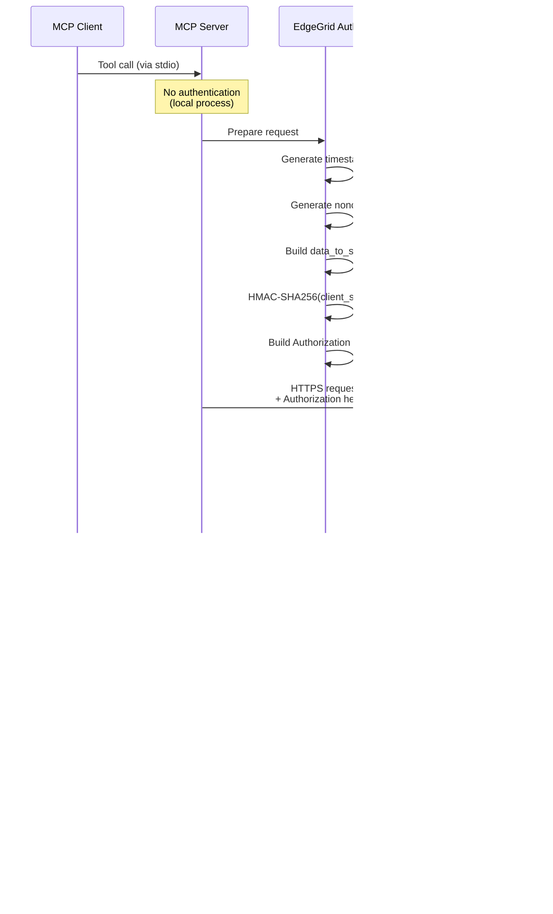

# Security Architecture
## Akamai MCP Server Security Design

**Document Version**: 1.0
**Date**: 2026-01-14
**Classification**: Confidential
**Framework**: NIST Cybersecurity Framework, ISO 27001

---

## Table of Contents

1. [Security Overview](#security-overview)
2. [Threat Model](#threat-model)
3. [Security Controls](#security-controls)
4. [Authentication & Authorization](#authentication--authorization)
5. [Data Protection](#data-protection)
6. [Network Security](#network-security)
7. [Security Monitoring](#security-monitoring)
8. [Compliance](#compliance)

---

## 1. Security Overview

### Security Posture


### Security Objectives

| Objective | Target | Current Status |
|-----------|--------|----------------|
| Confidentiality | Protect API credentials | ✅ Implemented |
| Integrity | Prevent request tampering | ✅ HMAC signing |
| Availability | 99.9% uptime | ✅ Retry logic |
| Authentication | Verify API client identity | ✅ EdgeGrid |
| Authorization | Enforce least privilege | ⚠️ Manual configuration |
| Auditability | Track all operations | ✅ Comprehensive logging |
| Non-repudiation | Cryptographic signatures | ✅ HMAC timestamps |

---

## 2. Threat Model

### STRIDE Threat Analysis

#### Spoofing
**Threat**: Attacker impersonates legitimate MCP client
**Impact**: Unauthorized API operations
**Mitigation**:
- stdio transport (local only)
- Process-level isolation
- No network exposure

**Risk Level**: 🟡 Low (Local access required)

#### Tampering
**Threat**: Attacker modifies API requests in transit
**Impact**: Unauthorized configuration changes
**Mitigation**:
- HMAC-SHA256 request signing
- TLS 1.2+ encryption
- Timestamp validation (prevents replay)

**Risk Level**: 🟢 Very Low (Cryptographic protection)

#### Repudiation
**Threat**: User denies performing operation
**Impact**: Accountability issues
**Mitigation**:
- Comprehensive audit logging
- Timestamped operations
- HMAC signatures include nonce

**Risk Level**: 🟢 Very Low (Full audit trail)

#### Information Disclosure
**Threat**: Credentials exposed in logs or memory
**Impact**: Account compromise
**Mitigation**:
- Environment variables for credentials
- Credential redaction in logs
- No credential persistence

**Risk Level**: 🟡 Low (Multiple protections)

#### Denial of Service
**Threat**: Resource exhaustion via excessive requests
**Impact**: Service unavailable
**Mitigation**:
- Client-side rate limiting (20 req/sec)
- Request timeouts (30s default)
- Exponential backoff on errors

**Risk Level**: 🟡 Low (Rate limiting)

#### Elevation of Privilege
**Threat**: Gain admin access to Akamai account
**Impact**: Full account compromise
**Mitigation**:
- API client permissions (Akamai-side)
- Least privilege principle
- No credential escalation path

**Risk Level**: 🟡 Low (Depends on API client config)

### Attack Surface

```
┌─────────────────────────────────────────────────────────────────┐
│                      Attack Surface Map                          │
└─────────────────────────────────────────────────────────────────┘

EXTERNAL INTERFACES (Public Attack Surface):
┌──────────────────────────────────────────────────────────────┐
│ Interface: stdio (Standard Input/Output)                     │
│ Exposure: Local process only                                 │
│ Authentication: None (process-level trust)                   │
│ Attack Vectors:                                              │
│  • Malicious input from compromised client                   │
│  • JSON injection in arguments                               │
│ Controls:                                                    │
│  ✅ Input validation (Zod schemas)                          │
│  ✅ Type checking (TypeScript)                              │
│  ✅ JSON parsing errors handled                             │
└──────────────────────────────────────────────────────────────┘

┌──────────────────────────────────────────────────────────────┐
│ Interface: File System (.env, logs)                         │
│ Exposure: Local file system                                 │
│ Authentication: OS-level permissions                        │
│ Attack Vectors:                                             │
│  • Credential theft from .env file                          │
│  • Log injection attacks                                    │
│  • Symlink attacks on log files                             │
│ Controls:                                                   │
│  ✅ File permission recommendations (chmod 600 .env)        │
│  ✅ Structured logging (JSON, no injection)                │
│  ⚠️ No automatic permission enforcement                    │
└──────────────────────────────────────────────────────────────┘

INTERNAL INTERFACES (Trusted):
┌──────────────────────────────────────────────────────────────┐
│ Interface: Akamai EdgeGrid API (HTTPS)                      │
│ Exposure: Internet (HTTPS only)                             │
│ Authentication: HMAC-SHA256 signatures                      │
│ Attack Vectors:                                             │
│  • Man-in-the-middle attacks                                │
│  • Certificate validation bypass                            │
│  • Replay attacks                                           │
│ Controls:                                                   │
│  ✅ TLS 1.2+ (certificate validation)                       │
│  ✅ HMAC signing with timestamp + nonce                     │
│  ✅ No credential transmission (only signatures)            │
└──────────────────────────────────────────────────────────────┘
```

---

## 3. Security Controls

### Control Framework


### Control Implementation Matrix

| Control ID | Control Name | Type | Implementation | Effectiveness |
|------------|-------------|------|----------------|---------------|
| **SC-001** | Input Validation | Preventive | Zod schema validation | High |
| **SC-002** | Output Encoding | Preventive | JSON serialization | High |
| **SC-003** | HMAC Authentication | Preventive | EdgeGrid library | Very High |
| **SC-004** | TLS Encryption | Preventive | Node.js HTTPS | Very High |
| **SC-005** | Rate Limiting | Preventive | Token bucket algorithm | High |
| **SC-006** | Request Timeout | Preventive | 30s default timeout | Medium |
| **SC-007** | Audit Logging | Detective | Winston structured logs | High |
| **SC-008** | Error Logging | Detective | Exception capture | High |
| **SC-009** | Health Monitoring | Detective | Health check endpoint | Medium |
| **SC-010** | Credential Rotation | Corrective | Manual process | Low |
| **SC-011** | Exponential Backoff | Recovery | Retry logic | High |
| **SC-012** | Graceful Shutdown | Recovery | SIGINT handler | High |

### Critical Security Controls

#### CSC-001: Credential Protection
```typescript
// Environment variable loading
const credentials = {
  host: process.env.AKAMAI_HOST,        // Not logged
  clientToken: process.env.AKAMAI_CLIENT_TOKEN,  // Redacted in logs
  clientSecret: process.env.AKAMAI_CLIENT_SECRET,  // Never logged
  accessToken: process.env.AKAMAI_ACCESS_TOKEN,    // Redacted in logs
};

// Logging with credential redaction
logger.info('Client initialized', {
  host: credentials.host.substring(0, 20) + '...',  // Partial redaction
  // Tokens not logged
});
```

#### CSC-002: Request Signing (HMAC)
```
Signature = HMAC-SHA256(
  client_secret,
  data_to_sign
)

data_to_sign =
  HTTP_method + "\t" +
  scheme + "://" + host + path + "\t" +
  headers + "\t" +
  content_hash + "\t" +
  timestamp + "\t" +
  nonce

Example:
POST	https://akab-xxx.luna.akamaiapis.net/papi/v1/properties
content-type:application/json
x-request-id:12345
body_hash_base64
20260114T12:34:56+0000
nonce_value
```

#### CSC-003: TLS Certificate Validation
```typescript
// Automatic via Node.js HTTPS module
const https = require('https');

// Certificate validation enabled by default
// Rejects self-signed certificates
// Validates certificate chain
// Checks certificate expiration
// Validates hostname
```

---

## 4. Authentication & Authorization

### Authentication Flow



### Authorization Model

```
┌─────────────────────────────────────────────────────────────────┐
│                   Authorization Hierarchy                        │
└─────────────────────────────────────────────────────────────────┘

[Akamai Account Owner]
          │
          ├─ Grants API Client Credentials
          │  (via Akamai Control Center)
          │
          ▼
[API Client Credentials]
  • client_token
  • client_secret
  • access_token
          │
          ├─ Assigned Permissions (Akamai-side)
          │  • Property Manager: Read/Write
          │  • Fast Purge: Read/Write
          │  • EdgeWorkers: Read/Write
          │  • DNS: Read/Write
          │
          ▼
[MCP Server]
  • Uses credentials for all operations
  • No additional authorization layer
  • Inherits API client permissions
          │
          ├─ Executes on behalf of user
          │  (No per-user permissions)
          │
          ▼
[Akamai Platform]
  • Enforces API client permissions
  • Rate limiting (per client)
  • Audit logging (per client)
```

### Permission Matrix

| Operation | Property Manager | Fast Purge | EdgeWorkers | DNS |
|-----------|-----------------|------------|-------------|-----|
| **List Resources** | READ | READ | READ | READ |
| **Get Details** | READ | READ | READ | READ |
| **Create** | WRITE | N/A | WRITE | WRITE |
| **Update** | WRITE | N/A | WRITE | WRITE |
| **Delete** | WRITE | N/A | N/A | WRITE |
| **Activate/Deploy** | WRITE | N/A | WRITE | N/A |
| **Purge** | N/A | WRITE | N/A | N/A |

**Note**: Permissions enforced by Akamai API client configuration, not by MCP server.

---

## 5. Data Protection

### Data Classification & Protection

| Data Type | Classification | Encryption at Rest | Encryption in Transit | Access Control |
|-----------|---------------|-------------------|---------------------|----------------|
| API Credentials | **Confidential** | OS file permissions | N/A (local) | 600 permissions |
| HMAC Signatures | **Internal** | N/A (ephemeral) | TLS 1.2+ | Process memory |
| API Requests | **Internal** | N/A (transient) | TLS 1.2+ | HTTPS only |
| API Responses | **Internal** | N/A (transient) | TLS 1.2+ | HTTPS only |
| Log Files | **Internal** | Optional | N/A (local) | 640 permissions |
| Configuration | **Internal** | Optional | N/A (local) | 640 permissions |

### Secrets Management


### Cryptographic Controls

#### Encryption Standards

| Purpose | Algorithm | Key Length | Standard |
|---------|-----------|-----------|----------|
| Request Signing | HMAC-SHA256 | 256-bit | RFC 2104 |
| Transport | TLS 1.2+ | 2048-bit RSA | RFC 5246 |
| Hashing | SHA-256 | 256-bit | FIPS 180-4 |

#### Key Management

```
Credential Lifecycle:

1. GENERATION
   ├─ User creates API client in Akamai Control Center
   ├─ Akamai generates: client_token, client_secret, access_token
   └─ User downloads credentials

2. DISTRIBUTION
   ├─ Manual: User copies to .env file
   ├─ Secret Manager: Automated injection
   └─ Access Control: File permissions (600)

3. STORAGE
   ├─ Development: .env file (gitignored)
   ├─ Production: Secret management service
   └─ Runtime: Environment variables (process memory)

4. USAGE
   ├─ Loaded on startup (not reloaded)
   ├─ Validated via Zod schema
   ├─ Used for HMAC signing
   └─ Never logged or persisted

5. ROTATION
   ├─ Manual process (Akamai Control Center)
   ├─ Generate new credentials
   ├─ Update configuration
   ├─ Restart server
   └─ Delete old credentials

6. DESTRUCTION
   ├─ Revoke in Akamai Control Center
   ├─ Remove from .env / secret manager
   └─ Restart or terminate process
```

---

## 6. Network Security

### Network Architecture

```
┌─────────────────────────────────────────────────────────────────┐
│                    Network Security Zones                        │
└─────────────────────────────────────────────────────────────────┘

┌─────────────────────────────────────────────────────────────────┐
│ Zone: Local (Trusted)                                           │
│  ┌───────────────────────────────────────────────────────────┐ │
│  │ MCP Client Process ←─ stdio (IPC) ─→ MCP Server Process  │ │
│  │  • No network exposure                                    │ │
│  │  • OS-level process isolation                             │ │
│  │  • Local-only communication                               │ │
│  └───────────────────────────────────────────────────────────┘ │
└─────────────────────────────────────────────────────────────────┘
                             │
                             │ Outbound HTTPS only
                             │ Port 443
                             ▼
┌─────────────────────────────────────────────────────────────────┐
│ Zone: Internet (Untrusted)                                      │
│  ┌───────────────────────────────────────────────────────────┐ │
│  │ TLS 1.2+ Tunnel                                           │ │
│  │  • Certificate validation                                 │ │
│  │  • Strong cipher suites                                   │ │
│  │  • Perfect forward secrecy                                │ │
│  └───────────────────────────────────────────────────────────┘ │
└─────────────────────────────────────────────────────────────────┘
                             │
                             ▼
┌─────────────────────────────────────────────────────────────────┐
│ Zone: Akamai (Semi-Trusted)                                    │
│  ┌───────────────────────────────────────────────────────────┐ │
│  │ Akamai EdgeGrid APIs                                      │ │
│  │  • *.luna.akamaiapis.net                                  │ │
│  │  • Load balanced                                          │ │
│  │  • DDoS protected                                         │ │
│  │  • Rate limited                                           │ │
│  └───────────────────────────────────────────────────────────┘ │
└─────────────────────────────────────────────────────────────────┘
```

### Network Security Controls

| Control | Implementation | Purpose |
|---------|---------------|---------|
| **TLS 1.2+** | Node.js HTTPS module | Encrypt data in transit |
| **Certificate Pinning** | Not implemented | Could add for extra security |
| **Egress Filtering** | Firewall rules (external) | Only allow *.akamaiapis.net |
| **No Ingress** | stdio only | No inbound network connections |
| **DNS Validation** | OS DNS resolver | Prevent DNS hijacking |

### TLS Configuration

```typescript
// Secure TLS defaults (Node.js)
const tlsOptions = {
  minVersion: 'TLSv1.2',  // Minimum TLS version
  maxVersion: 'TLSv1.3',  // Allow TLS 1.3
  ciphers: [
    'TLS_AES_128_GCM_SHA256',
    'TLS_AES_256_GCM_SHA384',
    'TLS_CHACHA20_POLY1305_SHA256',
    'ECDHE-RSA-AES128-GCM-SHA256',
    'ECDHE-RSA-AES256-GCM-SHA384'
  ].join(':'),
  rejectUnauthorized: true,  // Reject invalid certificates
  checkServerIdentity: true,  // Validate hostname
};
```

---

## 7. Security Monitoring

### Audit Logging

```typescript
// Security-relevant events logged:

// 1. Authentication Events
logger.info('EdgeGrid client initialized', {
  host: 'akab-...***',  // Redacted
  timestamp: new Date().toISOString()
});

// 2. API Operations
logger.info('API Request', {
  method: 'POST',
  path: '/papi/v1/properties/prp_123/activations',
  operation: 'activate_property',
  network: 'STAGING'
});

// 3. Authorization Failures
logger.error('HTTP 403: Insufficient permissions', {
  path: '/papi/v1/properties/prp_123',
  error: 'Forbidden'
});

// 4. Rate Limiting
logger.warn('Rate limit token unavailable', {
  tokensRemaining: 0,
  waitTime: 500
});

// 5. Configuration Changes
logger.info('Configuration loaded', {
  logLevel: 'info',
  maxRetries: 3
});

// 6. Errors and Exceptions
logger.error('API request failed', {
  error: 'ETIMEDOUT',
  retryCount: 2
});
```

### Security Events

| Event | Severity | Log Level | Retention | Alerting |
|-------|----------|-----------|-----------|----------|
| Startup | INFO | info | 30 days | No |
| Config Load | INFO | info | 30 days | No |
| API Request | INFO | info | 30 days | No |
| 401 Unauthorized | HIGH | error | 90 days | Yes |
| 403 Forbidden | HIGH | error | 90 days | Yes |
| Rate Limit Hit | MEDIUM | warn | 30 days | Threshold |
| Network Error | LOW | warn | 30 days | No |
| Timeout | MEDIUM | warn | 30 days | Threshold |
| Process Crash | CRITICAL | error | 90 days | Yes |

### Monitoring Architecture


---

## 8. Compliance

### Compliance Framework Mapping

#### NIST Cybersecurity Framework

| Function | Category | Implementation |
|----------|----------|---------------|
| **IDENTIFY** | Asset Management | Documentation of all components |
| **IDENTIFY** | Risk Assessment | Threat model (STRIDE) |
| **PROTECT** | Access Control | EdgeGrid authentication, file permissions |
| **PROTECT** | Data Security | TLS encryption, credential protection |
| **PROTECT** | Protective Technology | Input validation, rate limiting |
| **DETECT** | Anomalies & Events | Comprehensive logging |
| **DETECT** | Security Monitoring | Health checks, error tracking |
| **RESPOND** | Response Planning | Retry logic, error handling |
| **RECOVER** | Recovery Planning | Automatic retries, graceful shutdown |

#### ISO 27001 Controls

| Control | Description | Implementation Status |
|---------|-------------|---------------------|
| **A.9.2.1** | User registration | ✅ API client credentials |
| **A.9.2.2** | User access provisioning | ⚠️ Manual (Akamai Control Center) |
| **A.9.4.1** | Information access restriction | ✅ File permissions, process isolation |
| **A.10.1.1** | Cryptographic controls | ✅ HMAC, TLS 1.2+ |
| **A.12.3.1** | Information backup | ⚠️ Manual backup procedures |
| **A.12.4.1** | Event logging | ✅ Comprehensive audit logs |
| **A.14.2.5** | Secure system engineering | ✅ Security by design principles |
| **A.18.1.1** | Legal requirements | ✅ Akamai ToS compliance |

### Security Baseline Configuration

```bash
# Secure File Permissions
chmod 600 .env                    # Credentials (owner read/write only)
chmod 640 logs/akamai-mcp.log    # Logs (owner r/w, group read)
chmod 750 dist/                   # Code (owner all, group r/x)

# Environment Hardening
export NODE_ENV=production        # Disable debug features
export LOG_LEVEL=info             # Minimize verbose logging
unset HISTFILE                    # Disable command history

# Process Isolation (systemd)
NoNewPrivileges=true              # Prevent privilege escalation
PrivateTmp=true                   # Isolated /tmp
ProtectSystem=strict              # Read-only system directories
ProtectHome=true                  # No access to user homes
```

### Security Checklist

#### Deployment Security Checklist

- [ ] Credentials stored in secure secret manager (not .env in production)
- [ ] File permissions set correctly (600 for .env, 640 for logs)
- [ ] Running as non-root user
- [ ] API client has minimum required permissions
- [ ] TLS 1.2+ enforced for Akamai connections
- [ ] Log rotation configured (prevent disk fill)
- [ ] Health monitoring enabled
- [ ] Backup procedures documented
- [ ] Incident response plan defined
- [ ] Security contact information documented

#### Operational Security Checklist

- [ ] Credentials rotated regularly (every 90 days)
- [ ] Logs reviewed for security events
- [ ] Unauthorized access attempts monitored
- [ ] Rate limiting effectiveness verified
- [ ] API usage within expected bounds
- [ ] No credential exposure in logs confirmed
- [ ] Software dependencies up to date
- [ ] Security patches applied
- [ ] Backup tested and verified
- [ ] Disaster recovery plan tested

---

## Appendix: Security Incident Response

### Incident Classification

| Level | Description | Response Time | Escalation |
|-------|-------------|--------------|-----------|
| **P1 - Critical** | Credential compromise | Immediate | Security team |
| **P2 - High** | Unauthorized access | < 1 hour | Security team |
| **P3 - Medium** | Configuration error | < 4 hours | Operations team |
| **P4 - Low** | Minor policy violation | < 24 hours | Team lead |

### Response Procedures

#### Credential Compromise (P1)

1. **Immediate Actions** (0-5 minutes)
   - Revoke compromised credentials in Akamai Control Center
   - Stop all MCP server instances
   - Document time and nature of compromise

2. **Containment** (5-30 minutes)
   - Review recent API operations for unauthorized changes
   - Check for property activations, DNS changes, purges
   - Preserve logs for forensic analysis

3. **Eradication** (30-60 minutes)
   - Generate new API credentials
   - Update all deployments with new credentials
   - Restart services with new credentials

4. **Recovery** (1-4 hours)
   - Verify all services operational
   - Monitor for unusual activity
   - Restore any unauthorized changes

5. **Lessons Learned** (1-7 days)
   - Document incident timeline
   - Identify root cause
   - Implement preventive measures

---

**Document Control**

| Version | Date | Author | Changes |
|---------|------|--------|---------|
| 1.0 | 2026-01-14 | Security Team | Initial security architecture |

**Classification**: Confidential
**Next Review**: 2026-04-14
