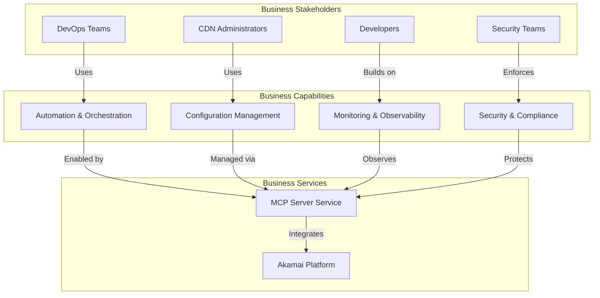
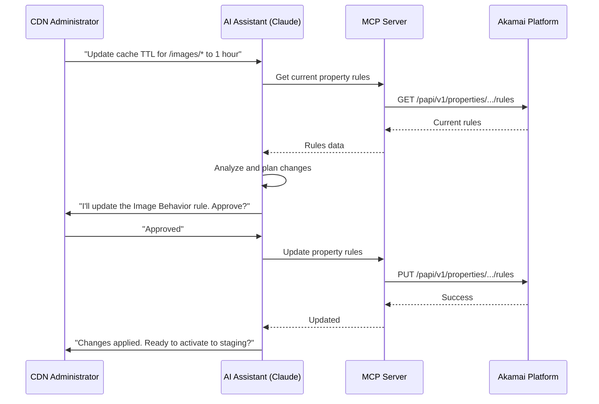
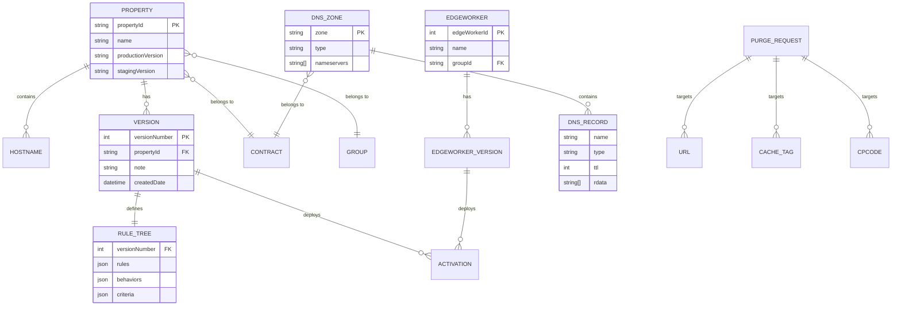
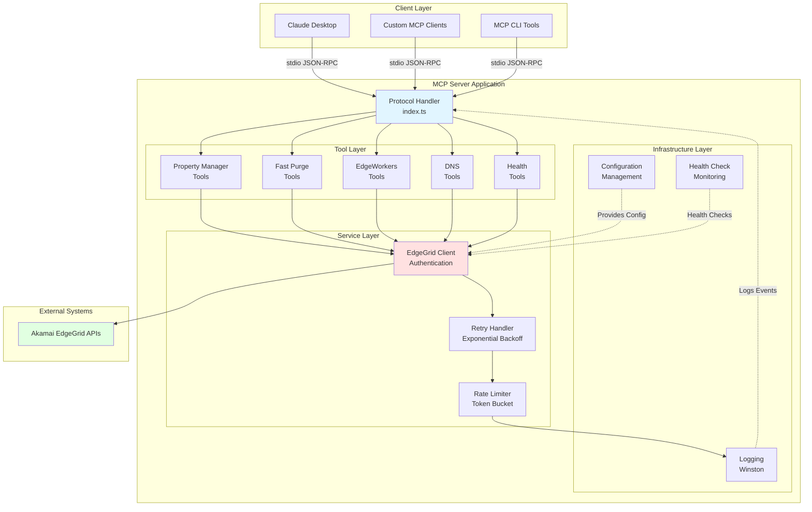
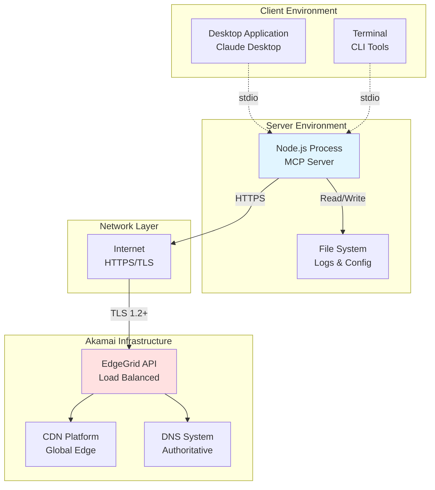
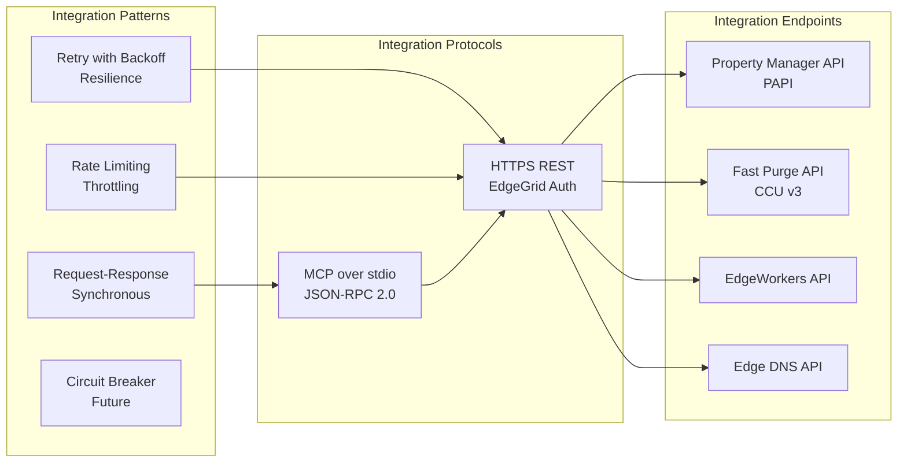

# TOGAF Architecture Views
## Akamai MCP Server Enterprise Architecture

**Document Version**: 1.0
**Date**: 2026-01-14
**Architecture Framework**: TOGAF 10
**Classification**: Internal Use

---

## Table of Contents

1. [Executive Summary](#executive-summary)
2. [Architecture Vision](#architecture-vision)
3. [Business Architecture](#business-architecture)
4. [Data Architecture](#data-architecture)
5. [Application Architecture](#application-architecture)
6. [Technology Architecture](#technology-architecture)
7. [Security Architecture](#security-architecture)
8. [Integration Architecture](#integration-architecture)
9. [Deployment Architecture](#deployment-architecture)
10. [Architecture Principles](#architecture-principles)
11. [Constraints and Assumptions](#constraints-and-assumptions)

---

## 1. Executive Summary

### Purpose
The Akamai MCP Server provides a standardized Model Context Protocol interface for AI assistants to interact with Akamai's CDN, security, and edge computing platform. This enables automated operations, intelligent decision-making, and seamless integration between AI systems and Akamai services.

### Scope
- **In Scope**: CDN management, cache control, EdgeWorkers deployment, DNS operations
- **Out of Scope**: Billing operations, user account management, custom API development

### Stakeholders
| Role | Responsibility | Interest |
|------|---------------|----------|
| DevOps Engineers | Deploy and maintain server | Reliability, observability |
| CDN Administrators | Manage Akamai configurations | Automation, efficiency |
| Security Teams | Ensure secure operations | Compliance, access control |
| AI Developers | Integrate with AI assistants | API usability, features |
| Platform Architects | System design and evolution | Scalability, maintainability |

---

## 2. Architecture Vision

### Strategic Goals
1. **Automation**: Enable AI-driven Akamai operations
2. **Standardization**: Provide consistent MCP interface
3. **Reliability**: 99.9% availability with automatic recovery
4. **Security**: Zero-trust architecture with minimal privileges
5. **Extensibility**: Easy addition of new Akamai APIs

### Key Drivers
- Increasing complexity of CDN operations
- Need for intelligent, context-aware automation
- Demand for AI-assisted troubleshooting
- Integration with modern AI assistants (Claude, ChatGPT, etc.)

### Success Metrics
- API response time < 2 seconds (p95)
- Zero security incidents
- 99.9% uptime
- Support for 100+ concurrent operations/minute
- < 0.1% error rate

---

## 3. Business Architecture

### Business Context Diagram



### Business Capabilities

#### BC-001: Configuration Management
- **Description**: Manage CDN properties, rules, and behaviors
- **Business Value**: Reduce manual configuration errors by 80%
- **Supporting Tools**: Property Manager tools

#### BC-002: Cache Optimization
- **Description**: Intelligent cache purging and invalidation
- **Business Value**: Improve cache hit ratio by 15%
- **Supporting Tools**: Fast Purge tools

#### BC-003: Edge Computing
- **Description**: Deploy and manage serverless functions
- **Business Value**: Reduce origin traffic by 30%
- **Supporting Tools**: EdgeWorkers tools

#### BC-004: DNS Operations
- **Description**: Automated DNS record management
- **Business Value**: Reduce DNS change lead time from hours to minutes
- **Supporting Tools**: DNS Management tools

### Business Process: CDN Configuration Change



---

## 4. Data Architecture

### Conceptual Data Model



### Data Flow Diagram

```
┌─────────────────────────────────────────────────────────────────┐
│                     Data Flow Overview                           │
└─────────────────────────────────────────────────────────────────┘

[MCP Client]
    │
    ├─ Request Data ────────────────┐
    │  • Tool name                   │
    │  • Arguments (JSON)            │
    │  • Request ID                  │
    │                                ▼
    │                    [MCP Protocol Layer]
    │                                │
    │                                ├─ Parse & Validate
    │                                ├─ Route to Handler
    │                                │
    ▼                                ▼
[Response Data]         [Tool Handler Layer]
    │                                │
    │                                ├─ Transform Arguments
    │                                ├─ Add Context
    │                                │
    │                                ▼
    │                    [EdgeGrid Client]
    │                                │
    │                                ├─ Add Authentication
    │                                ├─ Sign Request (HMAC)
    │                                ├─ Apply Rate Limiting
    │                                │
    │                                ▼
    │                    [Akamai EdgeGrid API]
    │                                │
    │                                ├─ Process Request
    │                                ├─ Execute Operation
    │                                ├─ Return Result
    │                                │
    └────────────────────────────────┘

Persisted Data:
┌──────────────────────────────────────────────────────────────────┐
│ Local File System                                                 │
│  • Configuration (.env)                                           │
│  • Logs (logs/akamai-mcp.log)                                    │
│  • Credentials (environment variables)                            │
└──────────────────────────────────────────────────────────────────┘

┌──────────────────────────────────────────────────────────────────┐
│ Akamai Platform (External)                                        │
│  • Property Configurations                                        │
│  • DNS Records                                                    │
│  • EdgeWorker Bundles                                            │
│  • Cache State                                                    │
│  • Audit Logs                                                     │
└──────────────────────────────────────────────────────────────────┘
```

### Data Classification

| Data Type | Classification | Encryption at Rest | Encryption in Transit | Retention |
|-----------|---------------|-------------------|---------------------|-----------|
| API Credentials | Confidential | Required | Required (TLS 1.2+) | Indefinite |
| Configuration Data | Internal | Optional | Required | 90 days |
| Log Data | Internal | Optional | N/A | 30 days |
| API Request/Response | Internal | Optional | Required | Real-time only |
| Property Rules | Internal | Optional | Required | Managed by Akamai |

---

## 5. Application Architecture

### Application Component Diagram



### Application Component Catalog

#### AC-001: Protocol Handler
- **Technology**: TypeScript, @modelcontextprotocol/sdk
- **Responsibilities**:
  - Handle MCP protocol messages
  - Route tool calls
  - Format responses
- **Interfaces**: stdio (JSON-RPC 2.0)
- **Dependencies**: Tool handlers

#### AC-002: Tool Handlers
- **Technology**: TypeScript
- **Responsibilities**:
  - Implement business logic
  - Validate inputs
  - Transform data
- **Interfaces**: Internal async functions
- **Dependencies**: EdgeGrid client

#### AC-003: EdgeGrid Client
- **Technology**: TypeScript, edgegrid npm package
- **Responsibilities**:
  - HMAC-SHA256 authentication
  - HTTP request/response handling
  - Connection management
- **Interfaces**: RESTful HTTP
- **Dependencies**: Akamai APIs

#### AC-004: Configuration Management
- **Technology**: TypeScript, Zod, dotenv
- **Responsibilities**:
  - Load environment variables
  - Validate configuration
  - Provide type-safe config access
- **Interfaces**: Internal singleton
- **Dependencies**: None

#### AC-005: Logging
- **Technology**: Winston
- **Responsibilities**:
  - Structured logging
  - Log rotation
  - Multi-transport output
- **Interfaces**: Internal logging API
- **Dependencies**: File system

### Application Interfaces

#### AI-001: MCP Protocol Interface (stdio)
```typescript
interface MCPRequest {
  jsonrpc: "2.0";
  id: number | string;
  method: "tools/call" | "tools/list";
  params: {
    name?: string;
    arguments?: Record<string, unknown>;
  };
}

interface MCPResponse {
  jsonrpc: "2.0";
  id: number | string;
  result?: {
    content: Array<{ type: "text"; text: string }>;
  };
  error?: {
    code: number;
    message: string;
  };
}
```

#### AI-002: Akamai EdgeGrid API Interface (HTTPS)
```typescript
interface EdgeGridRequest {
  method: "GET" | "POST" | "PUT" | "DELETE";
  path: string;
  headers: {
    "Authorization": string;  // EG1-HMAC-SHA256 signature
    "Content-Type"?: string;
  };
  body?: string;
}

interface EdgeGridResponse {
  statusCode: number;
  headers: Record<string, string>;
  body: unknown;
}
```

---

## 6. Technology Architecture

### Technology Stack Diagram

```
┌─────────────────────────────────────────────────────────────────┐
│                      Technology Stack                            │
└─────────────────────────────────────────────────────────────────┘

┌─────────────────────────────────────────────────────────────────┐
│ Runtime Environment                                              │
│  • Node.js 18+ (LTS)                                            │
│  • V8 JavaScript Engine                                         │
│  • Event Loop (async/await)                                     │
└─────────────────────────────────────────────────────────────────┘

┌─────────────────────────────────────────────────────────────────┐
│ Development Layer                                                │
│  • TypeScript 5.7+ (Type Safety)                                │
│  • TSC Compiler (ES2022 target)                                 │
│  • Source Maps (Debugging)                                      │
└─────────────────────────────────────────────────────────────────┘

┌─────────────────────────────────────────────────────────────────┐
│ Framework & Libraries                                            │
│  ┌──────────────────┬──────────────────┬──────────────────┐    │
│  │ MCP SDK v1.0+    │ EdgeGrid v3.5+   │ Axios v1.7+      │    │
│  │ (Protocol)       │ (Authentication) │ (HTTP Client)    │    │
│  └──────────────────┴──────────────────┴──────────────────┘    │
│  ┌──────────────────┬──────────────────┬──────────────────┐    │
│  │ Winston v3.17+   │ Zod v3.24+       │ Dotenv v16.4+    │    │
│  │ (Logging)        │ (Validation)     │ (Config)         │    │
│  └──────────────────┴──────────────────┴──────────────────┘    │
└─────────────────────────────────────────────────────────────────┘

┌─────────────────────────────────────────────────────────────────┐
│ Transport & Protocol                                             │
│  • stdio (Standard Input/Output)                                │
│  • JSON-RPC 2.0                                                 │
│  • HTTPS (TLS 1.2+)                                             │
└─────────────────────────────────────────────────────────────────┘

┌─────────────────────────────────────────────────────────────────┐
│ Security                                                         │
│  • HMAC-SHA256 (Request Signing)                                │
│  • TLS 1.2+ (Transport Encryption)                              │
│  • Environment Variables (Credential Storage)                    │
└─────────────────────────────────────────────────────────────────┘

┌─────────────────────────────────────────────────────────────────┐
│ Infrastructure                                                   │
│  • File System (Logs, Config)                                   │
│  • Process Management (systemd, PM2, Docker)                    │
│  • Operating System (Linux, macOS, Windows)                     │
└─────────────────────────────────────────────────────────────────┘
```

### Technology Standards

#### TS-001: Programming Language
- **Standard**: TypeScript 5.7+
- **Rationale**: Type safety, better IDE support, maintainability
- **Compliance**: ES2022 features, strict mode enabled

#### TS-002: Runtime Environment
- **Standard**: Node.js 18+ LTS
- **Rationale**: Long-term support, modern JavaScript features
- **Compliance**: ESM modules, native async/await

#### TS-003: Protocol
- **Standard**: Model Context Protocol (MCP) 1.0
- **Rationale**: Standardized AI-application interface
- **Compliance**: JSON-RPC 2.0, stdio transport

#### TS-004: Authentication
- **Standard**: Akamai EdgeGrid HMAC-SHA256
- **Rationale**: Required by Akamai platform
- **Compliance**: Official edgegrid npm package

#### TS-005: Logging
- **Standard**: Winston with JSON formatting
- **Rationale**: Structured logging, multiple transports
- **Compliance**: Log levels (error, warn, info, debug)

### Infrastructure Topology



---

## 7. Security Architecture

*See [SECURITY_ARCHITECTURE.md](SECURITY_ARCHITECTURE.md) for detailed security views*

### Security Zones

```
┌─────────────────────────────────────────────────────────────────┐
│ Trust Zone: CLIENT (Untrusted)                                  │
│  • Claude Desktop                                               │
│  • Custom MCP clients                                           │
│  • User workstations                                            │
│  Security Controls: None (untrusted input)                      │
└───────────────────────────┬─────────────────────────────────────┘
                            │ stdio (local IPC)
                            │ Input Validation Required
┌───────────────────────────▼─────────────────────────────────────┐
│ Trust Zone: APPLICATION (Trusted)                               │
│  • MCP Server Process                                           │
│  • Tool Handlers                                                │
│  • EdgeGrid Client                                              │
│  Security Controls:                                             │
│   - Input validation (Zod schemas)                              │
│   - Output sanitization                                         │
│   - Rate limiting                                               │
│   - Audit logging                                               │
└───────────────────────────┬─────────────────────────────────────┘
                            │ HTTPS/TLS 1.2+
                            │ HMAC-SHA256 Authentication
┌───────────────────────────▼─────────────────────────────────────┐
│ Trust Zone: EXTERNAL API (Semi-Trusted)                        │
│  • Akamai EdgeGrid APIs                                        │
│  Security Controls:                                             │
│   - Certificate validation                                      │
│   - Request signing (HMAC)                                      │
│   - Time-based nonces                                           │
│   - IP restrictions (Akamai side)                               │
└─────────────────────────────────────────────────────────────────┘
```

---

## 8. Integration Architecture

*See [INTEGRATION_ARCHITECTURE.md](INTEGRATION_ARCHITECTURE.md) for detailed integration patterns*

### Integration Overview



---

## 9. Deployment Architecture

*See [DEPLOYMENT_ARCHITECTURE.md](DEPLOYMENT_ARCHITECTURE.md) for detailed deployment views*

### Deployment Options

#### Option 1: Local Development
```
[Developer Workstation]
    └─ Node.js Process
        └─ MCP Server (stdio)
            └─ HTTPS → Akamai APIs
```

#### Option 2: Server Deployment
```
[Linux Server]
    └─ systemd / PM2
        └─ Node.js Process (managed)
            └─ MCP Server
                └─ HTTPS → Akamai APIs
```

#### Option 3: Container Deployment
```
[Container Platform]
    └─ Docker / Kubernetes
        └─ Container (akamai-mcp)
            └─ Node.js Process
                └─ MCP Server
                    └─ HTTPS → Akamai APIs
```

---

## 10. Architecture Principles

### AP-001: Simplicity
**Principle**: Keep the architecture simple and maintainable
**Rationale**: Reduces cognitive load and eases troubleshooting
**Implications**: Prefer simple solutions over complex abstractions

### AP-002: Security by Design
**Principle**: Security is built-in, not bolted-on
**Rationale**: Prevents security issues before they occur
**Implications**: All inputs validated, credentials protected, communications encrypted

### AP-003: Fail Fast
**Principle**: Detect and report errors immediately
**Rationale**: Easier debugging and prevents cascading failures
**Implications**: Configuration validated on startup, strict type checking

### AP-004: Observable
**Principle**: System behavior must be observable
**Rationale**: Essential for operations and troubleshooting
**Implications**: Comprehensive logging, health checks, metrics

### AP-005: Resilient
**Principle**: Handle transient failures gracefully
**Rationale**: External services are unreliable
**Implications**: Automatic retries, exponential backoff, rate limiting

### AP-006: Modular
**Principle**: Components are loosely coupled
**Rationale**: Easier to test, maintain, and extend
**Implications**: Clear boundaries, dependency injection, single responsibility

### AP-007: Standards-Based
**Principle**: Use industry standards where available
**Rationale**: Leverage existing knowledge and tools
**Implications**: MCP protocol, EdgeGrid auth, OpenAPI specs

### AP-008: Cloud-Agnostic
**Principle**: Not tied to specific cloud provider
**Rationale**: Flexibility in deployment
**Implications**: Standard Node.js, containerizable, no cloud-specific APIs

---

## 11. Constraints and Assumptions

### Technical Constraints

| ID | Constraint | Impact | Mitigation |
|----|-----------|--------|-----------|
| TC-001 | Node.js 18+ required | Limits platform support | Use LTS version, document requirements |
| TC-002 | stdio transport only | No remote access | Document local-only usage, suggest SSH tunneling |
| TC-003 | Akamai API rate limits | Max requests/second | Client-side rate limiting, exponential backoff |
| TC-004 | HMAC signing required | Adds latency (~5-10ms) | Acceptable for use case, optimize signing code |
| TC-005 | JSON-RPC 2.0 protocol | Limited to text responses | Sufficient for current use cases |

### Business Constraints

| ID | Constraint | Impact | Mitigation |
|----|-----------|--------|-----------|
| BC-001 | Akamai license required | Limits user base | Document prerequisites clearly |
| BC-002 | API credentials needed | Setup complexity | Provide detailed setup guide |
| BC-003 | Read/write permissions | Data modification risk | Document safety procedures, test in staging |

### Assumptions

| ID | Assumption | Risk if Invalid | Validation |
|----|-----------|----------------|-----------|
| AS-001 | Users have basic CLI knowledge | Poor user experience | Provide comprehensive documentation |
| AS-002 | Network connectivity stable | Intermittent failures | Implement retry logic |
| AS-003 | Akamai APIs remain stable | Breaking changes | Monitor API changelog, version pinning |
| AS-004 | stdio transport sufficient | Need for remote access | Document SSH/tunneling options |
| AS-005 | Single-tenant deployment | Credential sharing issues | Document security best practices |

---

## Appendix A: Glossary

| Term | Definition |
|------|-----------|
| **CDN** | Content Delivery Network - distributed network of servers for fast content delivery |
| **CP Code** | Content Provider Code - billing and reporting identifier in Akamai |
| **EdgeGrid** | Akamai's authentication protocol using HMAC-SHA256 |
| **EdgeWorkers** | Serverless JavaScript functions running on Akamai edge servers |
| **Fast Purge** | Akamai's cache invalidation service (formerly CCU) |
| **HMAC** | Hash-based Message Authentication Code - cryptographic authentication |
| **MCP** | Model Context Protocol - standardized protocol for AI-application integration |
| **PAPI** | Property Manager API - Akamai's configuration API |
| **stdio** | Standard Input/Output - console-based communication |
| **TTL** | Time To Live - cache duration in seconds |

---

## Appendix B: References

1. TOGAF 10 Standard, The Open Group
2. Akamai EdgeGrid Authentication Specification
3. Model Context Protocol Specification v1.0
4. NIST Cybersecurity Framework
5. ISO/IEC 27001 Information Security Management

---

## Document Control

| Version | Date | Author | Changes |
|---------|------|--------|---------|
| 1.0 | 2026-01-14 | Architecture Team | Initial TOGAF-compliant documentation |

**Approval Status**: Draft

**Next Review Date**: 2026-04-14
