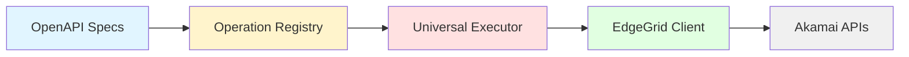

# Architecture Documentation

## Akamai MCP Server - Architecture Overview

**Version**: 3.0.0
**Last Updated**: 2026-01-15
**Status**: Production-Ready

---

## Quick Navigation

| Document | Description | Audience |
|----------|-------------|----------|
| [Context](context.md) | C4 Level 1 - System Context | All stakeholders |
| [Containers](containers.md) | C4 Level 2 - Container Architecture | Architects, Developers |
| [Components](components.md) | C4 Level 3 - Component Details | Developers, Maintainers |
| [Deployment](deployment.md) | Deployment Views by Environment | DevOps, Operations |
| [Data Flows](data-flows.md) | Data Flow Diagrams & Sensitive Paths | Security, Developers |
| [Security](security.md) | Threat Model & Security Controls | Security, Compliance |
| [TOGAF Mapping](togaf-mapping.md) | Enterprise Architecture Views | Enterprise Architects |
| [Decisions](decisions.md) | Architecture Decision Records | All technical staff |

---

## Executive Summary

The Akamai MCP Server is an enterprise-grade Model Context Protocol server providing **complete Akamai API coverage** through dynamic tool generation from OpenAPI specifications. Rather than maintaining hand-coded integrations, the system parses 59 Akamai OpenAPI specs at startup and automatically generates 1,444+ MCP tools.

### Key Architecture Characteristics

```
+------------------+--------------------------------------------+
| Characteristic   | Implementation                             |
+------------------+--------------------------------------------+
| Tool Coverage    | 1,444 operations from 59 OpenAPI specs     |
| Startup Time     | ~1 second (full registry load)             |
| Authentication   | EdgeGrid HMAC-SHA256                       |
| Transport        | stdio (JSON-RPC 2.0)                       |
| Reliability      | Circuit breaker, retry, rate limiting      |
| Security         | TLS 1.2+, credential protection            |
+------------------+--------------------------------------------+
```

### Architecture Philosophy



**Core Principle**: Dynamic generation from OpenAPI specs ensures 100% API coverage without manual tool maintenance.

---

## System Overview

### What is the Akamai MCP Server?

The Akamai MCP Server bridges AI assistants (Claude, ChatGPT, etc.) with Akamai's CDN, security, and edge computing platform. It implements the Model Context Protocol (MCP) to expose Akamai operations as AI-callable tools.

### Primary Use Cases

1. **CDN Configuration Management** - Create, modify, and deploy property configurations
2. **Cache Operations** - Purge URLs, tags, and CP codes from edge caches
3. **EdgeWorkers Deployment** - Deploy serverless functions to the edge
4. **DNS Management** - Manage DNS zones and records
5. **Security Operations** - Manage WAF rules, network lists, and security configurations
6. **Diagnostics** - Debug edge behavior, translate error codes, test connectivity

### Version History

| Version | Release | Key Features |
|---------|---------|--------------|
| v1.0 | Initial | 22 hand-coded tools (2% coverage) |
| v2.0 | Q4 2025 | Dynamic generation (100% coverage, 1,444 tools) |
| v3.0 | Q1 2026 | Enterprise reliability (circuit breaker, caching, connection pooling) |

---

## How to Use This Documentation

### For Architects

Start with [Context](context.md) for the big picture, then review [TOGAF Mapping](togaf-mapping.md) for enterprise architecture alignment.

### For Developers

Begin with [Components](components.md) to understand the code structure, then review [Decisions](decisions.md) for design rationale.

### For DevOps/Operations

Focus on [Deployment](deployment.md) for environment-specific configurations and [Security](security.md) for operational security controls.

### For Security Teams

Review [Security](security.md) for threat model and controls, and [Data Flows](data-flows.md) for sensitive data paths.

---

## Architecture Principles

| Principle | Description |
|-----------|-------------|
| **Dynamic Generation** | Tools generated from OpenAPI specs, not hand-coded |
| **Single Execution Path** | All requests flow through UniversalExecutor |
| **Security by Design** | Header allowlists, credential protection, TLS |
| **Fail Fast** | Configuration validated on startup |
| **Observable** | Comprehensive logging and health checks |
| **Resilient** | Retry logic, rate limiting, circuit breakers |

---

## Quick Reference

### Key Files

```
src/
├── index.ts                    # MCP server entry point
├── auth/
│   └── edgegrid-client.ts     # EdgeGrid authentication
├── registry/
│   └── operation-registry.ts  # OpenAPI spec parser
├── executor/
│   └── universal-executor.ts  # Single execution path
├── generator/
│   └── raw-request-tool.ts    # Core utility tools
├── tools/
│   ├── property-tools.ts      # CDN property management
│   ├── security-tools.ts      # WAF and security
│   ├── cache-tools.ts         # Fast Purge operations
│   └── ...                    # Other high-level tools
├── reliability/
│   ├── circuit-breaker.ts     # Cascade failure prevention
│   └── connection-pool.ts     # HTTP connection reuse
└── cache/
    └── response-cache.ts      # LRU response caching
```

### Key Metrics

| Metric | Target | Current |
|--------|--------|---------|
| Startup Time | < 2s | ~1s |
| Request Latency (p95) | < 2s | ~500ms |
| API Coverage | 100% | 100% (1,444 ops) |
| Memory Usage | < 100MB | ~50MB |

---

## Related Documentation

- [CLAUDE.md](../../CLAUDE.md) - Development guide and Claude Code integration
- [API Reference](../API_REFERENCE.md) - Tool-level API documentation
- [Security Architecture](../SECURITY_ARCHITECTURE.md) - Detailed security controls
- [TOGAF Views](../TOGAF_VIEWS.md) - Enterprise architecture views

---

## Open Questions and Gaps

1. **Multi-tenant support** - Currently single-tenant; consider credential isolation for multi-user scenarios
2. **Metrics export** - Internal metrics exist but no Prometheus/StatsD export yet
3. **Remote access** - stdio-only transport; may need HTTP/WebSocket for remote deployments
4. **Caching strategy** - GET-only caching; consider cache-aside pattern for write operations

---

*Generated: 2026-01-15*
*Next Review: 2026-04-15*
