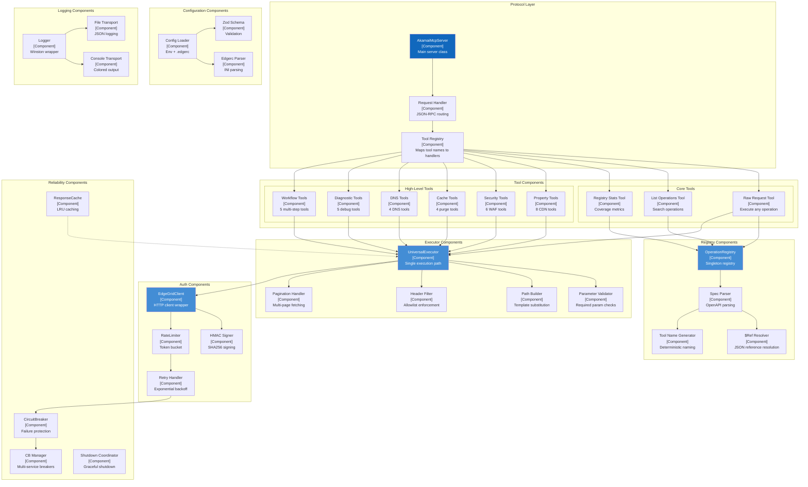
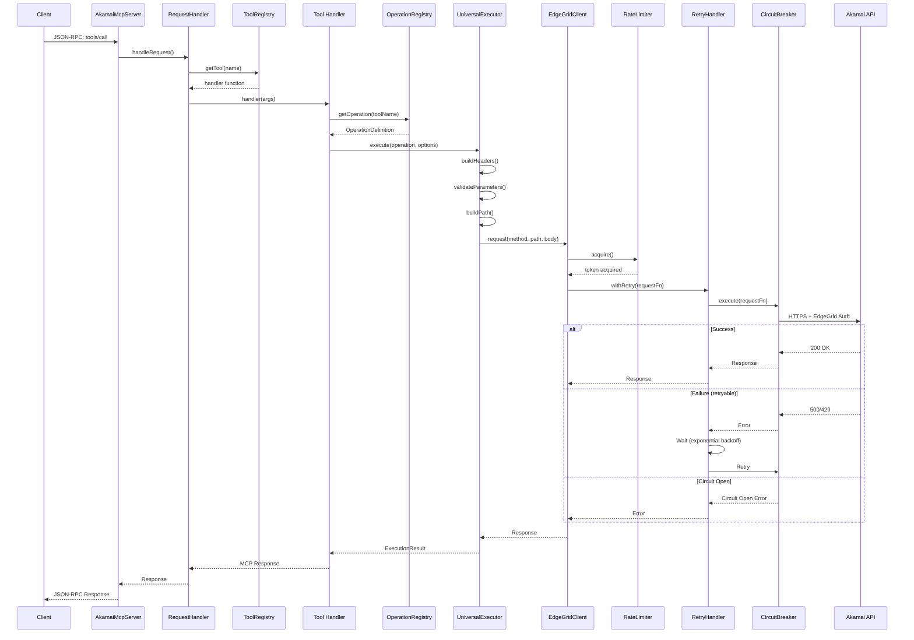

# Component Diagram (C4 Level 3)

## Akamai MCP Server - Component Architecture

**Document Version**: 1.0
**Last Updated**: 2026-01-15

---

## Component Diagram



---

## Component Catalog

### Protocol Layer Components

#### AkamaiMcpServer

**File**: `src/index.ts:29-206`
**Type**: Class (Singleton pattern)
**Responsibility**: Main server orchestration

**Key Methods**:
| Method | Visibility | Purpose |
|--------|------------|---------|
| `constructor()` | private | Initialize server, setup handlers |
| `loadTools()` | private | Load registry and register tools |
| `setupHandlers()` | private | Configure MCP protocol handlers |
| `start()` | public | Connect transport and start server |

**Dependencies**:
- `@modelcontextprotocol/sdk` - MCP protocol implementation
- `OperationRegistry` - Tool discovery
- `Logger` - Structured logging

---

### Registry Components

#### OperationRegistry

**File**: `src/registry/operation-registry.ts:31-452`
**Type**: Class (Singleton pattern)
**Responsibility**: Parse and index all Akamai OpenAPI specifications

**Data Structures**:
```typescript
private operations: Map<string, OperationDefinition>;     // 1,444 entries
private operationsByProduct: Map<string, string[]>;       // 59 products
private operationsByMethod: Map<string, string[]>;        // 7 methods
```

**Key Methods**:
| Method | Complexity | Purpose |
|--------|------------|---------|
| `load()` | O(n*m) | Parse all specs (n specs, m ops each) |
| `getOperation(toolName)` | O(1) | Lookup by tool name |
| `search(options)` | O(n) | Filter operations |
| `getStats()` | O(n) | Generate statistics |

**Parsing Pipeline**:
```
1. findSpecFiles(dir)     → Find all openapi.json files
2. loadSpec(file)         → Dereference $refs
3. parsePathItem(path)    → Extract operations
4. parseOperation(op)     → Build OperationDefinition
5. addOperation(op)       → Index in maps
```

#### OperationDefinition Type

```typescript
interface OperationDefinition {
  operationId: string;           // Original OpenAPI operationId
  toolName: string;              // Generated MCP tool name
  summary?: string;              // Short description
  description?: string;          // Full description
  method: string;                // HTTP method
  path: string;                  // URL path template
  product: string;               // Akamai product (papi, ccu, etc.)
  version: string;               // API version
  specFile: string;              // Source spec file
  pathParameters: ParameterDefinition[];
  queryParameters: ParameterDefinition[];
  headerParameters: ParameterDefinition[];
  requestBody?: RequestBodyDefinition;
  responses: Record<string, ResponseDefinition>;
  tags: string[];
  security?: SecurityRequirement[];
  servers?: ServerObject[];
  supportsPagination: boolean;   // Detected pagination support
}
```

---

### Executor Components

#### UniversalExecutor

**File**: `src/executor/universal-executor.ts:81-455`
**Type**: Class (Singleton pattern)
**Responsibility**: Single execution path for all API operations

**Execution Pipeline**:
```
1. buildHeaders()           → Apply allowlist, auto-inject required headers
2. validateParameters()     → Check required path/query/header params
3. buildPath()              → Substitute path templates
4. buildQueryParams()       → Convert to string map
5. executeSingle() or       → Make HTTP request
   executeWithPagination()  → Handle multi-page responses
```

**Key Methods**:
| Method | Purpose |
|--------|---------|
| `execute(operation, options)` | Main entry point |
| `validateParameters()` | Required param checking |
| `buildPath()` | Path template substitution |
| `buildHeaders()` | Header allowlist + auto-injection |
| `executeSingle()` | Single HTTP request |
| `executeWithPagination()` | Multi-page fetching |

**Header Allowlist**:
```typescript
const allowedHeaders = [
  'accept', 'content-type', 'if-match', 'if-none-match',
  'prefer', 'x-request-id', 'papi-use-prefixes',
  'x-akamai-contract', 'x-akamai-group', 'x-akamai-purge',
  'akamai-signature-algorithm'
];
```

**Pagination Detection**:
```typescript
// Detects pagination params: limit, offset, page, pageSize, cursor
// Detects pagination metadata: totalCount, nextPage, cursor, hasMore
```

---

### Auth Components

#### EdgeGridClient

**File**: `src/auth/edgegrid-client.ts:9-201`
**Type**: Class (Singleton pattern)
**Responsibility**: HMAC-SHA256 authenticated HTTP requests

**Key Methods**:
| Method | Purpose |
|--------|---------|
| `get(path, params?, headers?)` | HTTP GET |
| `post(path, body?, params?, headers?)` | HTTP POST |
| `put(path, body?, params?, headers?)` | HTTP PUT |
| `delete(path, params?, headers?)` | HTTP DELETE |
| `healthCheck()` | Credential validation |

**Request Pipeline**:
```
1. rateLimiter.acquire()    → Wait for token
2. EdgeGrid.auth(options)   → Build auth header
3. EdgeGrid.send(callback)  → Execute request
4. Parse response           → JSON or raw
5. withRetry()              → Retry on failure
```

#### RateLimiter

**File**: `src/utils/retry.ts:120-155`
**Type**: Class
**Algorithm**: Token Bucket

**Parameters**:
```typescript
{
  maxTokens: 20,      // Bucket capacity
  refillRate: 2       // Tokens per second
}
```

**Behavior**:
- Requests consume 1 token
- Tokens refill continuously
- Waits if no tokens available

---

### Reliability Components

#### CircuitBreaker

**File**: `src/reliability/circuit-breaker.ts:52-211`
**Type**: Class
**Pattern**: Circuit Breaker (Nygard)

**States**:
```
CLOSED    → Normal operation, requests pass through
OPEN      → Failing fast, requests rejected
HALF_OPEN → Testing recovery, limited requests
```

**Configuration**:
```typescript
{
  failureThreshold: 5,    // Failures to open
  successThreshold: 2,    // Successes to close
  timeout: 60000,         // Recovery timeout (ms)
  windowSize: 10000       // Failure tracking window (ms)
}
```

**Key Methods**:
| Method | Purpose |
|--------|---------|
| `execute(fn)` | Wrap function with circuit breaker |
| `onSuccess()` | Record successful execution |
| `onFailure()` | Record failed execution |
| `getStats()` | Get breaker statistics |

#### ResponseCache

**File**: `src/cache/response-cache.ts:41-378`
**Type**: Class (Singleton pattern)
**Algorithm**: LRU with TTL

**Configuration**:
```typescript
{
  defaultTTL: 60000,    // 1 minute
  maxSize: 1000,        // Max entries
  enabled: true
}
```

**Key Methods**:
| Method | Purpose |
|--------|---------|
| `get(key)` | Retrieve cached value |
| `set(key, data, ttl?)` | Store value |
| `delete(key)` | Remove entry |
| `invalidatePattern(regex)` | Bulk invalidation |
| `getStats()` | Cache statistics |

**Caching Policy**:
```typescript
// Only cache if:
ResponseCache.shouldCache(method, statusCode) {
  return method === 'GET' && statusCode >= 200 && statusCode < 300;
}
```

---

### Configuration Components

#### Config Loader

**File**: `src/utils/config.ts:97-152`
**Type**: Function + Singleton

**Loading Priority**:
1. Environment variables (`AKAMAI_HOST`, etc.)
2. `.edgerc` file (INI format)

**Validation Schema**:
```typescript
const configSchema = z.object({
  akamai: z.object({
    host: z.string().min(1),
    clientToken: z.string().min(1),
    clientSecret: z.string().min(1),
    accessToken: z.string().min(1),
    accountKey: z.string().optional()
  }),
  logging: z.object({
    level: z.enum(['error', 'warn', 'info', 'debug']),
    file: z.string()
  }),
  retry: z.object({
    maxRetries: z.number().min(0).max(10),
    retryDelayMs: z.number().min(100).max(10000)
  }),
  timeout: z.number().min(1000).max(300000)
});
```

---

## Component Interactions: Detailed Flow

### Tool Call Flow



---

## Component Dependencies

### Dependency Graph

```
AkamaiMcpServer
├── @modelcontextprotocol/sdk
├── OperationRegistry
│   ├── @apidevtools/json-schema-ref-parser
│   └── Logger
├── Tool Handlers
│   └── UniversalExecutor
│       ├── EdgeGridClient
│       │   ├── akamai-edgegrid
│       │   ├── RateLimiter
│       │   └── RetryHandler
│       └── Logger
├── ResponseCache
├── CircuitBreakerManager
└── ConfigLoader
    ├── zod
    └── dotenv
```

### External Dependencies

| Package | Version | Purpose |
|---------|---------|---------|
| `@modelcontextprotocol/sdk` | ^1.0.4 | MCP protocol |
| `akamai-edgegrid` | ^4.0.0 | EdgeGrid auth |
| `@apidevtools/json-schema-ref-parser` | ^11.7.2 | $ref resolution |
| `winston` | ^3.17.0 | Logging |
| `zod` | ^3.24.1 | Schema validation |
| `axios` | ^1.7.9 | HTTP client (backup) |
| `dotenv` | ^16.4.7 | Env var loading |

---

## Open Questions and Gaps

1. **Component testing** - Unit tests exist but component integration tests are limited
2. **Dependency injection** - Singleton pattern limits testability; consider DI container
3. **Event sourcing** - No event bus for cross-component communication
4. **Plugin architecture** - Tools are statically loaded; no runtime plugin support

---

*Generated: 2026-01-15*
