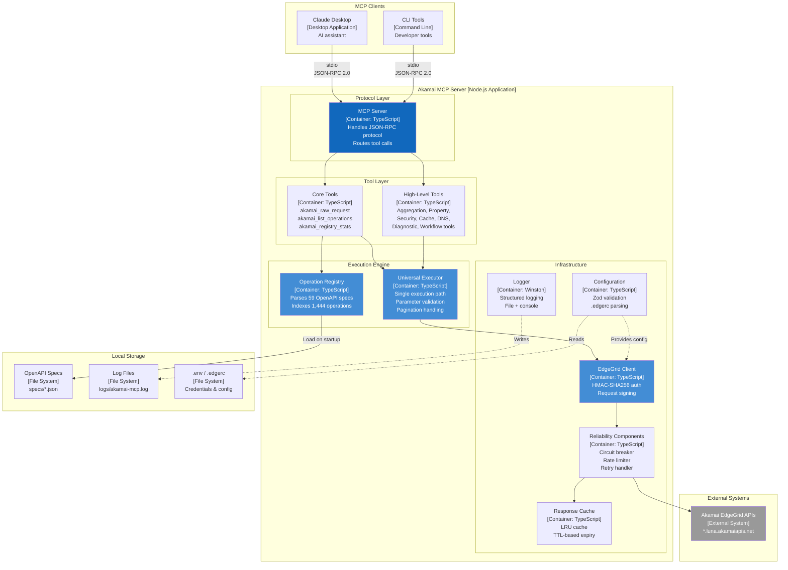
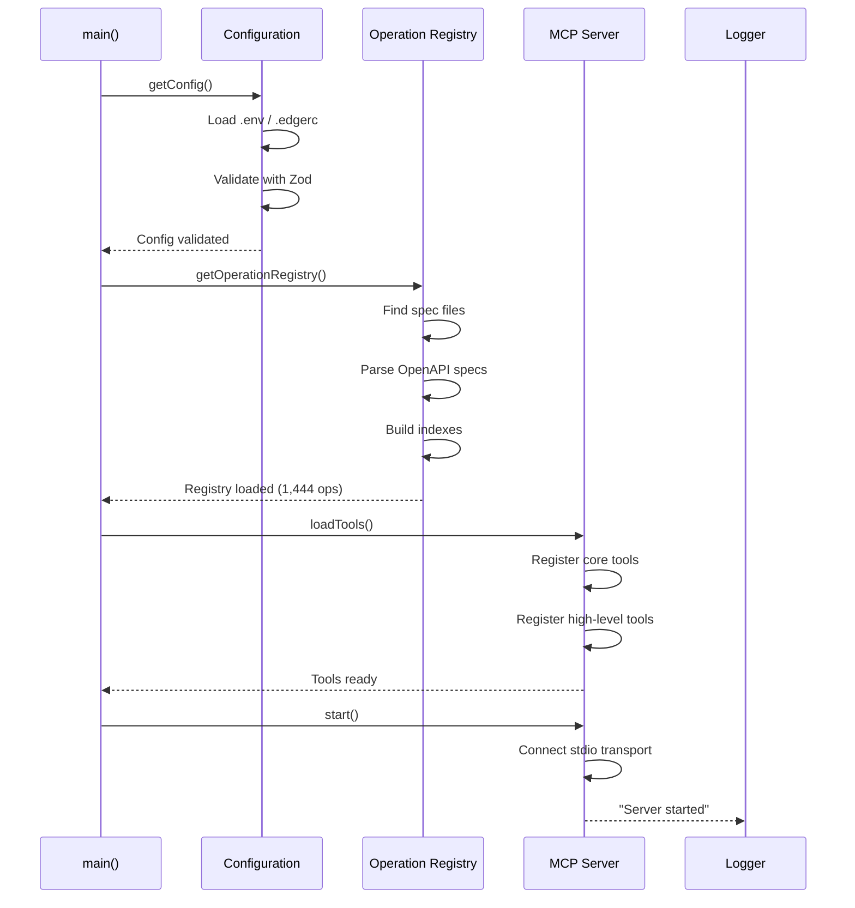
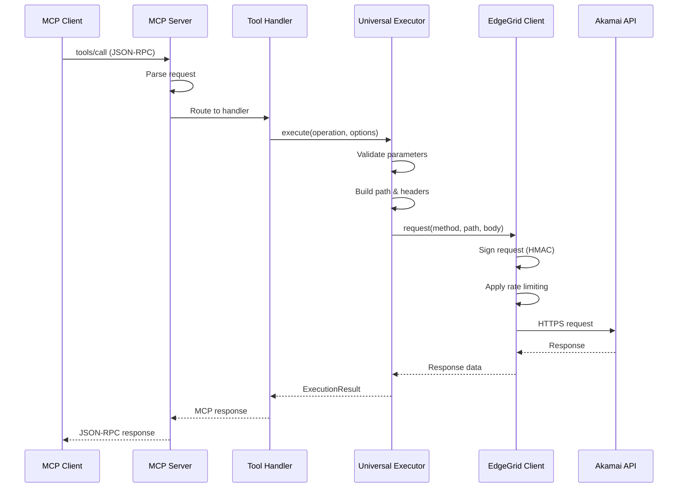

# Container Diagram (C4 Level 2)

## Akamai MCP Server - Container Architecture

**Document Version**: 1.0
**Last Updated**: 2026-01-15

---

## Container Diagram



---

## Container Descriptions

### Protocol Layer

#### MCP Server (`src/index.ts`)

**Technology**: TypeScript, @modelcontextprotocol/sdk
**Responsibility**: MCP protocol handling and tool routing
**Interfaces**:
- Inbound: stdio (JSON-RPC 2.0)
- Outbound: Internal function calls

**Key Functions**:
```typescript
- setupHandlers()      // Register MCP request handlers
- loadTools()          // Initialize tool registry
- start()              // Begin server operation
```

**Characteristics**:
- Singleton pattern
- Event-driven (JSON-RPC messages)
- Graceful shutdown handling (SIGINT)

---

### Tool Layer

#### Core Tools (`src/generator/raw-request-tool.ts`)

**Technology**: TypeScript
**Responsibility**: Low-level API access tools
**Tools Provided**:

| Tool Name | Purpose |
|-----------|---------|
| `akamai_raw_request` | Execute any operation by tool name |
| `akamai_list_operations` | Search/discover operations |
| `akamai_registry_stats` | Coverage statistics |

**Design Rationale**: These three tools provide complete API access while keeping MCP context size manageable (vs. 1,444 individual tool definitions).

#### High-Level Tools (`src/tools/*.ts`)

**Technology**: TypeScript
**Responsibility**: Domain-specific aggregated operations
**Tool Categories**:

| Module | Tools | Purpose |
|--------|-------|---------|
| `property-tools.ts` | 8 tools | Property management workflows |
| `security-tools.ts` | 6 tools | WAF and security operations |
| `cache-tools.ts` | 4 tools | Cache purge operations |
| `dns-tools.ts` | 4 tools | DNS management |
| `diagnostic-tools.ts` | 5 tools | Troubleshooting and debugging |
| `workflow-tools.ts` | 5 tools | Multi-step operations |
| `reporting-tools.ts` | 4 tools | Performance and error reports |
| `certificate-tools.ts` | 5 tools | SSL/TLS management |
| `account-tools.ts` | 4 tools | Multi-account operations |
| `dnssec-tools.ts` | 4 tools | DNSSEC management |

---

### Execution Engine

#### Operation Registry (`src/registry/operation-registry.ts`)

**Technology**: TypeScript, @apidevtools/json-schema-ref-parser
**Responsibility**: OpenAPI spec parsing and indexing
**Data Structures**:

```typescript
Map<string, OperationDefinition>  // By tool name
Map<string, string[]>             // By product
Map<string, string[]>             // By HTTP method
```

**Key Functions**:
```typescript
- load()              // Parse all OpenAPI specs
- getOperation()      // O(1) lookup by tool name
- search()            // Filter by product/method/query
- getStats()          // Coverage statistics
```

**Performance**:
- Load time: ~900ms (59 specs, 1,444 operations)
- Lookup time: O(1)
- Memory: ~20MB

#### Universal Executor (`src/executor/universal-executor.ts`)

**Technology**: TypeScript
**Responsibility**: Single execution path for all API calls
**Key Functions**:

```typescript
- execute()                    // Main entry point
- validateParameters()         // Required param checking
- buildPath()                  // Path template substitution
- buildQueryParams()           // Query string construction
- buildHeaders()               // Header allowlist filtering
- executeSingle()              // Single request execution
- executeWithPagination()      // Multi-page fetching
```

**Security Controls**:
- Header allowlist (prevents injection)
- Path parameter encoding
- Required parameter validation

---

### Infrastructure Layer

#### EdgeGrid Client (`src/auth/edgegrid-client.ts`)

**Technology**: TypeScript, akamai-edgegrid npm package
**Responsibility**: HMAC-SHA256 authentication and HTTP requests
**Interface Methods**:

```typescript
- get<T>(path, params?, headers?)
- post<T>(path, body?, params?, headers?)
- put<T>(path, body?, params?, headers?)
- delete<T>(path, params?, headers?)
- healthCheck()
```

**Security Features**:
- HMAC-SHA256 request signing
- Timestamp and nonce generation
- Credential protection (never logged)

#### Reliability Components (`src/reliability/*.ts`)

**Components**:

| Component | File | Purpose |
|-----------|------|---------|
| Circuit Breaker | `circuit-breaker.ts` | Cascade failure prevention |
| Rate Limiter | (in `retry.ts`) | Token bucket algorithm |
| Retry Handler | `retry.ts` | Exponential backoff |
| Connection Pool | `connection-pool.ts` | HTTP keep-alive |
| Shutdown Coordinator | `shutdown-coordinator.ts` | Graceful shutdown |

**Circuit Breaker States**:
```
CLOSED → (failures >= threshold) → OPEN
OPEN → (timeout elapsed) → HALF_OPEN
HALF_OPEN → (successes >= threshold) → CLOSED
HALF_OPEN → (failure) → OPEN
```

**Rate Limiter Algorithm**:
```
Token Bucket:
- Capacity: 20 tokens
- Refill rate: 2 tokens/second
- Wait if no tokens available
```

#### Response Cache (`src/cache/response-cache.ts`)

**Technology**: TypeScript (custom LRU implementation)
**Responsibility**: Cache GET responses to reduce API calls
**Configuration**:

```typescript
{
  defaultTTL: 60000,    // 1 minute
  maxSize: 1000,        // entries
  enabled: true
}
```

**Cache Policy**:
- Only cache GET requests
- Only cache 2xx responses
- LRU eviction when full
- Automatic TTL expiry

#### Configuration (`src/utils/config.ts`)

**Technology**: TypeScript, Zod, dotenv
**Responsibility**: Configuration loading and validation
**Sources** (priority order):
1. Environment variables
2. `.edgerc` file (~/.edgerc or project local)

**Schema**:
```typescript
{
  akamai: {
    host: string,
    clientToken: string,
    clientSecret: string,
    accessToken: string,
    accountKey?: string
  },
  logging: {
    level: 'error' | 'warn' | 'info' | 'debug',
    file: string
  },
  retry: {
    maxRetries: number,
    retryDelayMs: number
  },
  timeout: number
}
```

#### Logger (`src/utils/logger.ts`)

**Technology**: Winston
**Responsibility**: Structured logging
**Outputs**:
- Console (colored, formatted)
- File (JSON, rotatable)

**Log Levels**:
```
error → Critical failures
warn  → Recoverable issues, rate limiting
info  → Normal operations, startup/shutdown
debug → Detailed request/response data
```

---

## Container Interactions

### Startup Sequence



### Request Flow



---

## Container: Resource Requirements

| Container | Memory | CPU | Disk |
|-----------|--------|-----|------|
| MCP Server | ~50MB | Low | Minimal |
| Operation Registry | ~20MB | Spike at startup | N/A |
| Response Cache | ~10-50MB | Minimal | N/A |
| Logger | ~5MB | Minimal | ~100MB/day |

**Total**: ~50-100MB RAM, low CPU, minimal disk

---

## Open Questions and Gaps

1. **Registry refresh** - Currently loads once at startup; no hot-reload when specs change
2. **Cache persistence** - In-memory only; loses cache on restart
3. **Metrics export** - No Prometheus/StatsD integration yet
4. **Health endpoint** - Health checks are CLI-only, not HTTP-exposed

---

*Generated: 2026-01-15*
