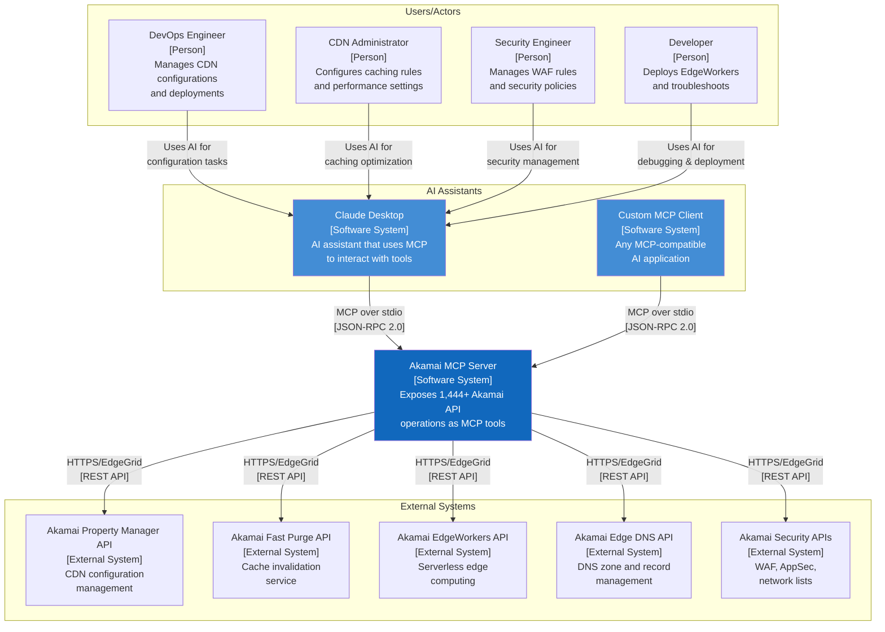
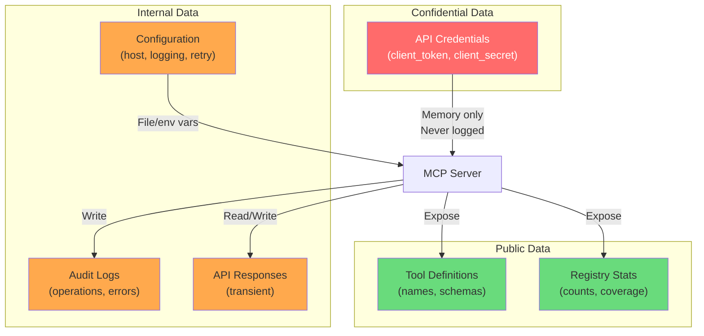

# System Context (C4 Level 1)

## Akamai MCP Server - System Context Diagram

**Document Version**: 1.0
**Last Updated**: 2026-01-15

---

## Context Diagram



---

## System Context Description

### The Akamai MCP Server

The **Akamai MCP Server** is the central system that bridges AI assistants with Akamai's platform services. It serves as an intelligent gateway that:

1. **Dynamically generates tools** from 59 Akamai OpenAPI specifications
2. **Provides 1,444+ operations** covering all Akamai APIs
3. **Handles authentication** via EdgeGrid HMAC-SHA256 signing
4. **Ensures reliability** through retry logic, rate limiting, and circuit breakers

### Key Interactions

#### Upstream (Clients)

| Actor | Interaction | Protocol | Purpose |
|-------|-------------|----------|---------|
| Claude Desktop | MCP tool calls | stdio/JSON-RPC | AI-driven operations |
| Custom MCP Clients | MCP tool calls | stdio/JSON-RPC | Programmatic automation |

#### Downstream (External Systems)

| System | Interaction | Protocol | Purpose |
|--------|-------------|----------|---------|
| Property Manager API | HTTPS requests | EdgeGrid | CDN configuration |
| Fast Purge API | HTTPS requests | EdgeGrid | Cache invalidation |
| EdgeWorkers API | HTTPS requests | EdgeGrid | Serverless deployment |
| Edge DNS API | HTTPS requests | EdgeGrid | DNS management |
| Security APIs | HTTPS requests | EdgeGrid | WAF/AppSec management |

---

## User Personas

### DevOps Engineer

**Goals**: Automate CDN deployments, reduce manual configuration errors
**Typical Operations**:
- Property version management
- Activation workflows (staging → production)
- Bulk hostname onboarding
- Configuration comparison between versions

**Example Interaction**:
```
User: "Deploy the current staging configuration to production with the note 'Q1 release'"
AI: Uses akamai_activate_property to activate staging version to production network
```

### CDN Administrator

**Goals**: Optimize caching, manage cache invalidation, improve performance
**Typical Operations**:
- Cache TTL adjustments
- URL and tag-based purging
- Cache hit ratio analysis
- Origin configuration

**Example Interaction**:
```
User: "Purge all images under /assets/2024/ from production cache"
AI: Uses akamai_purge_urls with wildcard pattern
```

### Security Engineer

**Goals**: Manage WAF rules, respond to threats, ensure compliance
**Typical Operations**:
- Network list management (IP blocking/allowing)
- WAF rule tuning
- Security event analysis
- Rate limiting configuration

**Example Interaction**:
```
User: "Add 192.168.1.0/24 to the production blocklist"
AI: Uses akamai_modify_network_list to add CIDR block
```

### Developer

**Goals**: Deploy edge code, debug issues, test configurations
**Typical Operations**:
- EdgeWorker deployment
- URL diagnosis
- Error code translation
- Edge-to-origin connectivity testing

**Example Interaction**:
```
User: "What does Akamai error reference 12.abc123.xyz mean?"
AI: Uses akamai_translate_error to decode the reference
```

---

## External System Dependencies

### Akamai Property Manager API (PAPI)

**Purpose**: CDN configuration management
**Operations**: ~400 endpoints
**Key Capabilities**:
- Property CRUD operations
- Rule tree management
- Hostname configuration
- Activation workflows

**Dependency Characteristics**:
- Availability: 99.99% SLA
- Latency: 100-500ms typical
- Rate Limits: Per-client throttling

### Akamai Fast Purge API (CCU v3)

**Purpose**: Cache invalidation
**Operations**: ~20 endpoints
**Key Capabilities**:
- URL purge
- Cache tag purge
- CP code purge
- Bulk purge operations

**Dependency Characteristics**:
- Availability: 99.99% SLA
- Purge completion: < 5 seconds
- Rate Limits: 50,000 purges/day (varies by contract)

### Akamai EdgeWorkers API

**Purpose**: Serverless edge computing
**Operations**: ~50 endpoints
**Key Capabilities**:
- EdgeWorker CRUD
- Version management
- Activation/deactivation
- Resource limit management

**Dependency Characteristics**:
- Availability: 99.99% SLA
- Activation time: 5-15 minutes
- Bundle size limit: 1MB

### Akamai Edge DNS API

**Purpose**: DNS zone and record management
**Operations**: ~100 endpoints
**Key Capabilities**:
- Zone management
- Record CRUD
- DNSSEC operations
- Bulk record updates

**Dependency Characteristics**:
- Availability: 100% SLA (authoritative DNS)
- Propagation: Near-instant
- Rate Limits: Per-client throttling

### Akamai Security APIs

**Purpose**: WAF, AppSec, and network security
**Operations**: ~300 endpoints
**Key Capabilities**:
- Security configuration management
- Network list management
- WAF rule tuning
- Security event retrieval

**Dependency Characteristics**:
- Availability: 99.99% SLA
- Configuration activation: 5-15 minutes
- Event data: Near real-time

---

## Trust Boundaries

```
┌─────────────────────────────────────────────────────────────────────┐
│ TRUST BOUNDARY 1: Local Machine                                      │
│                                                                      │
│  ┌────────────────┐      ┌────────────────────────┐                │
│  │ MCP Client     │◄────►│ Akamai MCP Server      │                │
│  │ (Claude, etc.) │ stdio│ (Node.js process)      │                │
│  │                │      │                        │                │
│  │ [Untrusted     │      │ [Trusted Application]  │                │
│  │  Input]        │      │ - Input validation     │                │
│  │                │      │ - Rate limiting        │                │
│  └────────────────┘      └──────────┬─────────────┘                │
│                                     │                               │
└─────────────────────────────────────│───────────────────────────────┘
                                      │ HTTPS/TLS 1.2+
                                      │ EdgeGrid HMAC-SHA256
┌─────────────────────────────────────│───────────────────────────────┐
│ TRUST BOUNDARY 2: Internet          │                                │
│                                     ▼                                │
│  ┌────────────────────────────────────────────────────────────┐    │
│  │                  Akamai EdgeGrid APIs                       │    │
│  │                  [Semi-Trusted External System]             │    │
│  │                                                             │    │
│  │  - Certificate validation                                   │    │
│  │  - HMAC signature verification                              │    │
│  │  - API client permission enforcement                        │    │
│  │  - Rate limiting                                            │    │
│  └────────────────────────────────────────────────────────────┘    │
│                                                                      │
└──────────────────────────────────────────────────────────────────────┘
```

---

## Communication Patterns

### MCP Client → MCP Server

```
Protocol:     JSON-RPC 2.0 over stdio
Transport:    Standard input/output (process pipes)
Security:     Process isolation (no network exposure)
Data Format:  JSON
Direction:    Bidirectional
```

### MCP Server → Akamai APIs

```
Protocol:     HTTPS REST
Transport:    TLS 1.2+ encrypted
Security:     EdgeGrid HMAC-SHA256 authentication
Data Format:  JSON
Direction:    Request/Response
```

---

## Context Diagram: Data Classification View



---

## Open Questions and Gaps

1. **Remote access pattern** - Current stdio transport limits deployment to local machine; may need HTTP/WebSocket for server deployments
2. **Multi-client isolation** - Single-tenant model; no session isolation between concurrent MCP clients
3. **Akamai account switching** - Supports account switch keys but no dynamic account selection per request
4. **Offline operation** - No offline mode; all operations require Akamai API connectivity

---

*Generated: 2026-01-15*
