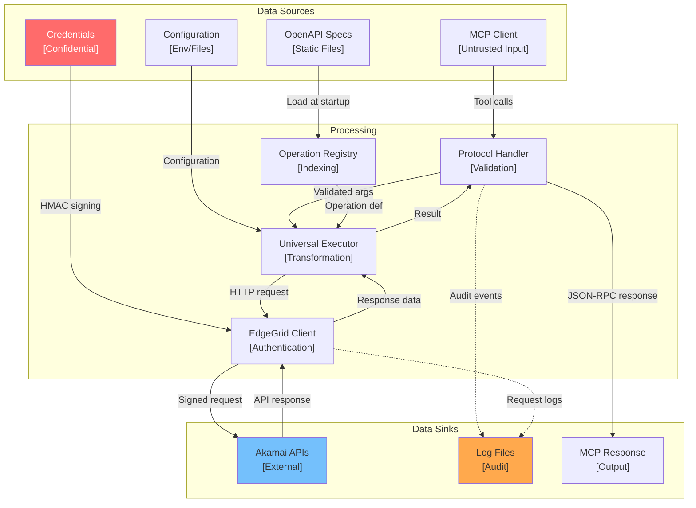
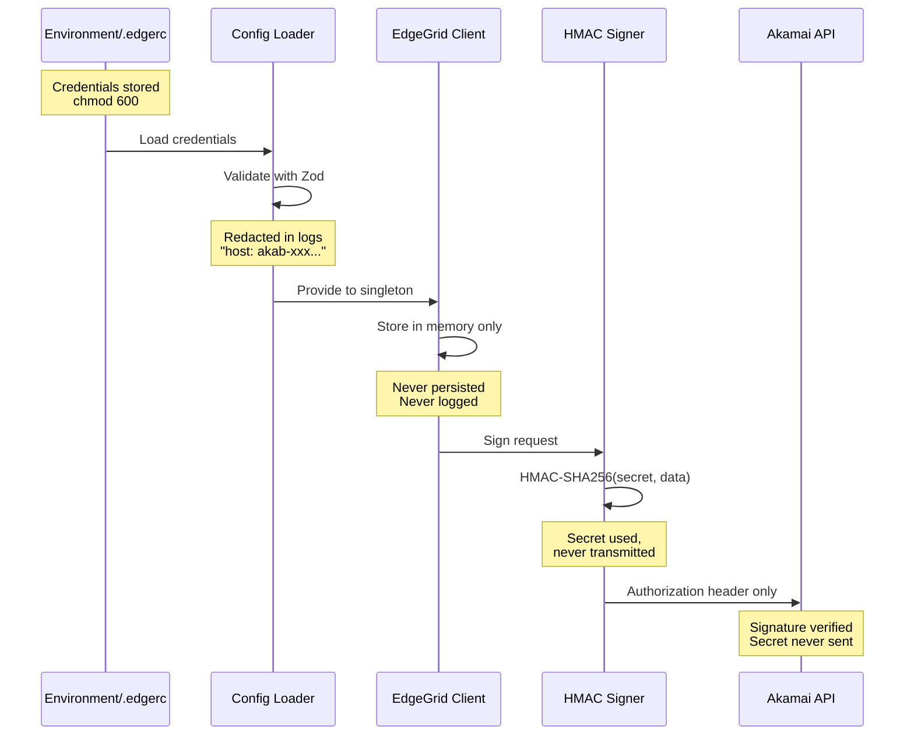
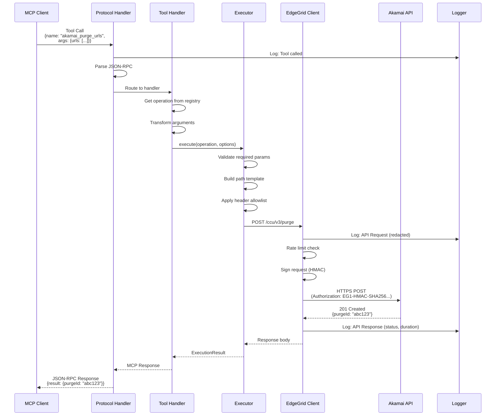

# Data Flow Diagrams

## Akamai MCP Server - Data Flows and Sensitive Data Paths

**Document Version**: 1.0
**Last Updated**: 2026-01-15

---

## Data Flow Overview



---

## Data Flow Diagrams (DFD)

### Level 0: Context DFD

```
┌─────────────────────────────────────────────────────────────────┐
│                     Context Data Flow                            │
└─────────────────────────────────────────────────────────────────┘

                    ┌─────────────────┐
                    │   MCP Client    │
                    │ (Claude, etc.)  │
                    └────────┬────────┘
                             │
                Tool Calls   │   Results
                (JSON-RPC)   ▼   (JSON)
                    ┌────────────────────┐
                    │                    │
      Config ─────► │  Akamai MCP       │ ─────► Logs
      Creds  ─────► │  Server           │
      Specs  ─────► │                    │
                    │                    │
                    └────────┬───────────┘
                             │
               HTTPS Requests│   Responses
               (EdgeGrid)    ▼   (JSON)
                    ┌────────────────────┐
                    │   Akamai APIs      │
                    └────────────────────┘
```

### Level 1: System DFD

```
┌─────────────────────────────────────────────────────────────────┐
│                     Level 1 Data Flow                            │
└─────────────────────────────────────────────────────────────────┘

[MCP Client]
      │
      │ Tool Call Request
      │ {name, arguments}
      ▼
┌──────────────────────────────┐
│ 1.0 Protocol Handler         │
│                              │
│ • Parse JSON-RPC             │
│ • Route to tool              │
│ • Format response            │
└──────────┬───────────────────┘
           │
           │ Validated Arguments
           ▼
┌──────────────────────────────┐      ┌─────────────────────┐
│ 2.0 Tool Handler             │◄─────│ D1: Operation       │
│                              │      │     Registry        │
│ • Get operation definition   │      │ (1,444 operations)  │
│ • Transform arguments        │      └─────────────────────┘
│ • Call executor              │
└──────────┬───────────────────┘
           │
           │ Operation + Options
           ▼
┌──────────────────────────────┐
│ 3.0 Universal Executor       │
│                              │
│ • Validate parameters        │
│ • Build path & headers       │
│ • Handle pagination          │
└──────────┬───────────────────┘
           │
           │ HTTP Request Data
           ▼
┌──────────────────────────────┐      ┌─────────────────────┐
│ 4.0 EdgeGrid Client          │◄─────│ D2: Credentials     │
│                              │      │ (client_secret)     │
│ • Sign with HMAC-SHA256      │      └─────────────────────┘
│ • Apply rate limiting        │
│ • Execute with retry         │
└──────────┬───────────────────┘
           │
           │ Signed HTTPS Request
           ▼
┌──────────────────────────────┐
│ [Akamai APIs]                │
│                              │
│ • Validate signature         │
│ • Process request            │
│ • Return response            │
└──────────┬───────────────────┘
           │
           │ API Response
           │ (flows back through
           │  same path)
           ▼
[MCP Client Response]
```

---

## Sensitive Data Flows

### Credential Flow (CRITICAL)



### Credential Data Classification

| Data Element | Classification | In Memory | In Logs | In Transit |
|--------------|---------------|-----------|---------|------------|
| `host` | Internal | Yes | Partial | No |
| `client_token` | Confidential | Yes | No | In auth header |
| `client_secret` | Confidential | Yes | **Never** | **Never** |
| `access_token` | Confidential | Yes | No | In auth header |
| HMAC signature | Internal | Ephemeral | No | Yes |

### Credential Protection Controls

```
┌─────────────────────────────────────────────────────────────────┐
│ Credential Protection Layers                                     │
└─────────────────────────────────────────────────────────────────┘

1. STORAGE
   ┌─────────────────────────────────────────────────────────────┐
   │ • File permissions: chmod 600 .env, .edgerc                 │
   │ • Environment variables (not command line args)            │
   │ • Secret managers (Vault, AWS Secrets Manager)             │
   └─────────────────────────────────────────────────────────────┘

2. LOADING
   ┌─────────────────────────────────────────────────────────────┐
   │ • Load once at startup                                      │
   │ • Validate structure (Zod schema)                          │
   │ • Store in singleton (single copy)                         │
   └─────────────────────────────────────────────────────────────┘

3. USAGE
   ┌─────────────────────────────────────────────────────────────┐
   │ • HMAC signing only (never transmitted raw)                │
   │ • No credential concatenation to strings                   │
   │ • No credential in error messages                          │
   └─────────────────────────────────────────────────────────────┘

4. LOGGING
   ┌─────────────────────────────────────────────────────────────┐
   │ • Host: partial redaction (akab-xxx...)                    │
   │ • Tokens: NEVER logged                                     │
   │ • Secrets: NEVER logged                                    │
   │ • Signatures: NEVER logged                                 │
   └─────────────────────────────────────────────────────────────┘
```

---

## Request/Response Data Flow

### Tool Call Flow



### Data Transformation Points

| Stage | Input | Transformation | Output |
|-------|-------|----------------|--------|
| Protocol Handler | JSON-RPC request | Parse, validate | Typed args |
| Tool Handler | Typed args | Map to operation params | ExecutionOptions |
| Executor | ExecutionOptions | Path substitution, headers | HTTP request |
| EdgeGrid Client | HTTP request | Add auth header | Signed request |
| Akamai API | Signed request | Process operation | JSON response |
| (Return path) | JSON response | Wrap in MCP format | JSON-RPC response |

---

## Audit Data Flow

### Audit Events Generated

```
┌─────────────────────────────────────────────────────────────────┐
│ Audit Event Sources                                              │
└─────────────────────────────────────────────────────────────────┘

[Startup Events]
├── Server started
├── Configuration loaded (settings, not credentials)
├── Registry loaded (operation count)
└── Tools registered

[Request Events]
├── Tool call received (name, timestamp)
├── API request initiated (method, path, sanitized params)
├── API response received (status, duration, request ID)
└── Tool call completed (success/error)

[Error Events]
├── Validation failures (parameter errors)
├── Authentication failures (401/403)
├── Rate limit events (429)
├── Network errors (timeout, connection)
└── Server errors (500+)

[Shutdown Events]
├── Shutdown signal received
├── In-flight requests drained
└── Server stopped
```

### Log Data Schema

```typescript
interface AuditLogEntry {
  timestamp: string;      // ISO 8601
  level: 'error' | 'warn' | 'info' | 'debug';
  message: string;
  context: {
    toolName?: string;    // MCP tool called
    operation?: string;   // Akamai operation
    method?: string;      // HTTP method
    path?: string;        // API path (no query params with secrets)
    status?: number;      // HTTP status
    duration?: number;    // Request duration (ms)
    requestId?: string;   // X-Request-ID
    error?: string;       // Error message (sanitized)
  };
}
```

### Log Data Classification

| Log Field | Classification | Example | Notes |
|-----------|---------------|---------|-------|
| timestamp | Public | 2026-01-15T10:30:00Z | Always logged |
| level | Public | info | Always logged |
| message | Internal | "API request completed" | Always logged |
| toolName | Internal | akamai_purge_urls | Always logged |
| path | Internal | /ccu/v3/purge | No query params |
| status | Internal | 201 | Always logged |
| duration | Internal | 234 | Always logged |
| requestId | Internal | abc123-... | Always logged |
| error | Internal | "Rate limit exceeded" | Sanitized |
| credentials | **Never** | - | Never logged |
| request body | Debug only | - | May contain PII |
| response body | Debug only | - | May contain PII |

---

## Trust Boundary Crossings

### Data Crossing Boundaries

```
┌─────────────────────────────────────────────────────────────────┐
│ Trust Boundary Analysis                                          │
└─────────────────────────────────────────────────────────────────┘

BOUNDARY 1: MCP Client → MCP Server
────────────────────────────────────
Direction: Inbound
Protocol: stdio (JSON-RPC 2.0)
Trust Level: Untrusted → Trusted
Data: Tool calls with arguments

Controls Applied:
✅ JSON parsing (syntax validation)
✅ Schema validation (Zod)
✅ Type coercion
✅ Required parameter checking
✅ Sanitization of special characters


BOUNDARY 2: MCP Server → Akamai API
────────────────────────────────────
Direction: Outbound
Protocol: HTTPS (EdgeGrid)
Trust Level: Trusted → Semi-Trusted
Data: API requests with signed auth

Controls Applied:
✅ TLS 1.2+ encryption
✅ HMAC-SHA256 authentication
✅ Header allowlist
✅ Path parameter encoding
✅ Rate limiting
✅ Request timeout


BOUNDARY 3: Akamai API → MCP Server
────────────────────────────────────
Direction: Inbound
Protocol: HTTPS response
Trust Level: Semi-Trusted → Trusted
Data: API responses

Controls Applied:
✅ TLS certificate validation
✅ JSON parsing
✅ Response validation
✅ Error normalization
```

---

## Data Retention

### Retention Policy

| Data Type | Location | Retention | Purge Method |
|-----------|----------|-----------|--------------|
| Credentials | Memory | Session lifetime | Process termination |
| Configuration | Memory | Session lifetime | Process termination |
| Registry data | Memory | Session lifetime | Process termination |
| Request cache | Memory | TTL (1 minute default) | Automatic expiry |
| Log files | Disk | Configurable (30 days) | Log rotation |
| API responses | Memory | Transient | Request completion |

### Data Lifecycle

```
┌─────────────────────────────────────────────────────────────────┐
│ Data Lifecycle                                                   │
└─────────────────────────────────────────────────────────────────┘

CREDENTIALS
───────────
Load (.env/.edgerc) → Store (memory) → Use (signing) → Destroy (exit)
                                              │
                                              └─► Never persisted
                                              └─► Never transmitted raw

OPERATION REGISTRY
──────────────────
Load (specs) → Parse → Index → Query → Destroy (exit)
                          │
                          └─► Static after load
                          └─► No external persistence

REQUEST CACHE
─────────────
Create (response) → Store → Query → Expire (TTL) → Evict (LRU)
                                          │
                                          └─► Automatic cleanup
                                          └─► Memory only

LOGS
────
Generate → Write (file) → Rotate → Archive/Delete
                             │
                             └─► Configurable retention
                             └─► May ship to SIEM
```

---

## Open Questions and Gaps

1. **PII in API responses** - Some Akamai responses may contain email addresses or usernames; no automatic redaction
2. **Request body logging** - Debug level logs may include request bodies; consider field-level redaction
3. **Log shipping** - No built-in integration with SIEM; manual configuration required
4. **Data lineage** - No formal data lineage tracking across the pipeline

---

*Generated: 2026-01-15*
