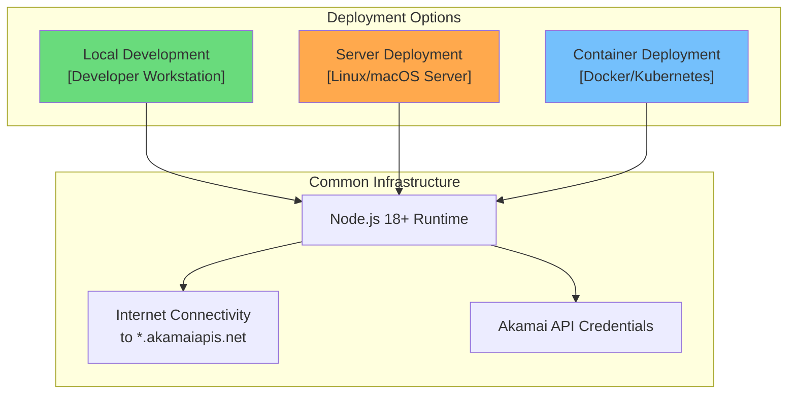

# Deployment Architecture

## Akamai MCP Server - Deployment Views

**Document Version**: 1.0
**Last Updated**: 2026-01-15

---

## Deployment Overview

The Akamai MCP Server supports multiple deployment models depending on the use case. As an MCP server using stdio transport, it runs as a child process of the MCP client (typically Claude Desktop or a custom application).



---

## Environment Matrix

| Environment | Purpose | Credentials | Network | Logging |
|-------------|---------|-------------|---------|---------|
| **Local Dev** | Development, testing | `.env` file | Direct internet | Console + file |
| **CI/CD** | Automated testing | Environment vars | CI network | Console only |
| **Staging** | Pre-production validation | Secret manager | VPN/direct | Centralized |
| **Production** | Live operations | Secret manager | VPN/direct | Centralized + SIEM |

---

## Deployment Model 1: Local Development

### Architecture

```
┌──────────────────────────────────────────────────────────────┐
│ Developer Workstation (macOS/Linux/Windows)                  │
│                                                              │
│  ┌─────────────────┐        ┌─────────────────────────────┐ │
│  │ Claude Desktop  │◄──────►│ Node.js Process             │ │
│  │ [MCP Client]    │ stdio  │ [Akamai MCP Server]         │ │
│  │                 │        │                              │ │
│  │                 │        │ ┌─────────────────────────┐ │ │
│  │                 │        │ │ .env                     │ │ │
│  │                 │        │ │ - AKAMAI_HOST           │ │ │
│  │                 │        │ │ - AKAMAI_CLIENT_TOKEN   │ │ │
│  │                 │        │ │ - AKAMAI_CLIENT_SECRET  │ │ │
│  │                 │        │ │ - AKAMAI_ACCESS_TOKEN   │ │ │
│  │                 │        │ └─────────────────────────┘ │ │
│  └─────────────────┘        └────────────┬────────────────┘ │
│                                          │                   │
└──────────────────────────────────────────│───────────────────┘
                                           │ HTTPS/TLS 1.2+
                                           ▼
                              ┌─────────────────────────┐
                              │ Akamai EdgeGrid APIs    │
                              │ *.luna.akamaiapis.net   │
                              └─────────────────────────┘
```

### Configuration: Claude Desktop

**File**: `~/.claude/mcp.json` (macOS/Linux) or `%APPDATA%\Claude\mcp.json` (Windows)

```json
{
  "mcpServers": {
    "akamai": {
      "command": "node",
      "args": ["/absolute/path/to/akamai-mcp-server/dist/index.js"],
      "env": {
        "LOG_LEVEL": "info"
      }
    }
  }
}
```

### Credential Options

**Option A: Environment Variables in mcp.json**
```json
{
  "mcpServers": {
    "akamai": {
      "command": "node",
      "args": ["/path/to/dist/index.js"],
      "env": {
        "AKAMAI_HOST": "akab-xxx.luna.akamaiapis.net",
        "AKAMAI_CLIENT_TOKEN": "akab-client-token",
        "AKAMAI_CLIENT_SECRET": "secret-value",
        "AKAMAI_ACCESS_TOKEN": "akab-access-token"
      }
    }
  }
}
```

**Option B: .edgerc File (Recommended)**
```ini
# ~/.edgerc
[default]
host = akab-xxx.luna.akamaiapis.net
client_token = akab-client-token
client_secret = secret-value
access_token = akab-access-token
```

```json
{
  "mcpServers": {
    "akamai": {
      "command": "node",
      "args": ["/path/to/dist/index.js"]
    }
  }
}
```

### File Permissions

```bash
# Secure credential files
chmod 600 ~/.edgerc
chmod 600 .env

# Logs directory
chmod 750 logs/
chmod 640 logs/*.log
```

---

## Deployment Model 2: Server Deployment

### Architecture

```
┌──────────────────────────────────────────────────────────────┐
│ Linux Server (Ubuntu 22.04 / RHEL 8+)                        │
│                                                              │
│  ┌─────────────────────────────────────────────────────────┐│
│  │ Process Manager (systemd / PM2)                          ││
│  │                                                          ││
│  │  ┌─────────────────────────────────────────────────────┐││
│  │  │ Node.js 18 LTS                                       │││
│  │  │                                                      │││
│  │  │  ┌────────────────────────────────────────────────┐ │││
│  │  │  │ Akamai MCP Server                              │ │││
│  │  │  │ - Runs as dedicated user (akamai-mcp)          │ │││
│  │  │  │ - Isolated working directory                   │ │││
│  │  │  │ - Credentials from secret manager              │ │││
│  │  │  └────────────────────────────────────────────────┘ │││
│  │  │                                                      │││
│  │  └──────────────────────────────────────────────────────┘││
│  │                                                          ││
│  └──────────────────────────────────────────────────────────┘│
│                                                              │
│  ┌──────────────┐  ┌──────────────┐  ┌──────────────────┐   │
│  │ /var/log/    │  │ Secret Mgr   │  │ Firewall         │   │
│  │ akamai-mcp/  │  │ (Vault, AWS) │  │ (egress only)    │   │
│  └──────────────┘  └──────────────┘  └──────────────────┘   │
│                                                              │
└──────────────────────────────────────────────────────────────┘
```

### systemd Service Configuration

**File**: `/etc/systemd/system/akamai-mcp.service`

```ini
[Unit]
Description=Akamai MCP Server
After=network.target

[Service]
Type=simple
User=akamai-mcp
Group=akamai-mcp
WorkingDirectory=/opt/akamai-mcp-server
ExecStart=/usr/bin/node dist/index.js
Restart=on-failure
RestartSec=10

# Environment
Environment=NODE_ENV=production
Environment=LOG_LEVEL=info
EnvironmentFile=-/etc/akamai-mcp/credentials

# Security hardening
NoNewPrivileges=true
PrivateTmp=true
ProtectSystem=strict
ProtectHome=true
ReadWritePaths=/var/log/akamai-mcp

# Resource limits
MemoryMax=256M
CPUQuota=50%

[Install]
WantedBy=multi-user.target
```

### Credential Management

**Option A: Environment File**
```bash
# /etc/akamai-mcp/credentials (chmod 600)
AKAMAI_HOST=akab-xxx.luna.akamaiapis.net
AKAMAI_CLIENT_TOKEN=akab-client-token
AKAMAI_CLIENT_SECRET=secret-value
AKAMAI_ACCESS_TOKEN=akab-access-token
```

**Option B: HashiCorp Vault**
```bash
# Fetch credentials at startup
export AKAMAI_HOST=$(vault kv get -field=host secret/akamai/mcp)
export AKAMAI_CLIENT_TOKEN=$(vault kv get -field=client_token secret/akamai/mcp)
export AKAMAI_CLIENT_SECRET=$(vault kv get -field=client_secret secret/akamai/mcp)
export AKAMAI_ACCESS_TOKEN=$(vault kv get -field=access_token secret/akamai/mcp)
```

### Firewall Rules

```bash
# Allow only outbound HTTPS to Akamai APIs
iptables -A OUTPUT -p tcp --dport 443 -d luna.akamaiapis.net -j ACCEPT
iptables -A OUTPUT -p tcp --dport 443 -j DROP  # Block other HTTPS

# Allow DNS for resolution
iptables -A OUTPUT -p udp --dport 53 -j ACCEPT
```

---

## Deployment Model 3: Container Deployment

### Dockerfile

```dockerfile
# Build stage
FROM node:18-alpine AS builder

WORKDIR /app
COPY package*.json ./
RUN npm ci --only=production

COPY . .
RUN npm run build

# Runtime stage
FROM node:18-alpine

# Security: Run as non-root
RUN addgroup -g 1001 -S akamai && \
    adduser -u 1001 -S akamai -G akamai

WORKDIR /app

# Copy built artifacts
COPY --from=builder --chown=akamai:akamai /app/dist ./dist
COPY --from=builder --chown=akamai:akamai /app/specs ./specs
COPY --from=builder --chown=akamai:akamai /app/node_modules ./node_modules
COPY --from=builder --chown=akamai:akamai /app/package.json ./

# Create logs directory
RUN mkdir -p /app/logs && chown akamai:akamai /app/logs

USER akamai

ENV NODE_ENV=production
ENV LOG_LEVEL=info

# Health check
HEALTHCHECK --interval=30s --timeout=10s --start-period=5s --retries=3 \
  CMD node dist/cli/health-check.js || exit 1

ENTRYPOINT ["node", "dist/index.js"]
```

### Docker Compose

```yaml
version: '3.8'

services:
  akamai-mcp:
    build: .
    image: akamai-mcp-server:3.0.0
    container_name: akamai-mcp
    restart: unless-stopped

    environment:
      - NODE_ENV=production
      - LOG_LEVEL=info
      # Credentials from secrets
      - AKAMAI_HOST_FILE=/run/secrets/akamai_host
      - AKAMAI_CLIENT_TOKEN_FILE=/run/secrets/akamai_client_token
      - AKAMAI_CLIENT_SECRET_FILE=/run/secrets/akamai_client_secret
      - AKAMAI_ACCESS_TOKEN_FILE=/run/secrets/akamai_access_token

    secrets:
      - akamai_host
      - akamai_client_token
      - akamai_client_secret
      - akamai_access_token

    volumes:
      - ./logs:/app/logs

    deploy:
      resources:
        limits:
          cpus: '0.5'
          memory: 256M
        reservations:
          cpus: '0.1'
          memory: 64M

    security_opt:
      - no-new-privileges:true

    read_only: true
    tmpfs:
      - /tmp:size=10M

secrets:
  akamai_host:
    external: true
  akamai_client_token:
    external: true
  akamai_client_secret:
    external: true
  akamai_access_token:
    external: true
```

### Kubernetes Deployment

```yaml
apiVersion: apps/v1
kind: Deployment
metadata:
  name: akamai-mcp-server
  labels:
    app: akamai-mcp
spec:
  replicas: 1
  selector:
    matchLabels:
      app: akamai-mcp
  template:
    metadata:
      labels:
        app: akamai-mcp
    spec:
      securityContext:
        runAsNonRoot: true
        runAsUser: 1001
        runAsGroup: 1001
        fsGroup: 1001

      containers:
        - name: akamai-mcp
          image: akamai-mcp-server:3.0.0
          imagePullPolicy: IfNotPresent

          resources:
            requests:
              memory: "64Mi"
              cpu: "100m"
            limits:
              memory: "256Mi"
              cpu: "500m"

          env:
            - name: NODE_ENV
              value: "production"
            - name: LOG_LEVEL
              value: "info"

          envFrom:
            - secretRef:
                name: akamai-credentials

          securityContext:
            allowPrivilegeEscalation: false
            readOnlyRootFilesystem: true
            capabilities:
              drop:
                - ALL

          volumeMounts:
            - name: logs
              mountPath: /app/logs
            - name: tmp
              mountPath: /tmp

          livenessProbe:
            exec:
              command:
                - node
                - dist/cli/health-check.js
            initialDelaySeconds: 10
            periodSeconds: 30

          readinessProbe:
            exec:
              command:
                - node
                - dist/cli/health-check.js
            initialDelaySeconds: 5
            periodSeconds: 10

      volumes:
        - name: logs
          emptyDir: {}
        - name: tmp
          emptyDir:
            sizeLimit: 10Mi

---
apiVersion: v1
kind: Secret
metadata:
  name: akamai-credentials
type: Opaque
stringData:
  AKAMAI_HOST: "akab-xxx.luna.akamaiapis.net"
  AKAMAI_CLIENT_TOKEN: "akab-client-token"
  AKAMAI_CLIENT_SECRET: "secret-value"
  AKAMAI_ACCESS_TOKEN: "akab-access-token"
```

---

## Network Architecture

### Network Zones

```
┌─────────────────────────────────────────────────────────────────┐
│ Zone: Internal Network (Trusted)                                 │
│                                                                  │
│  ┌─────────────────────────────────────────────────────────┐   │
│  │ MCP Client ◄──── stdio ────► MCP Server                  │   │
│  │ (Claude)         (IPC)       (Node.js)                   │   │
│  └─────────────────────────────────────────────────────────┘   │
│                                                                  │
└────────────────────────────────┬────────────────────────────────┘
                                 │
                                 │ Firewall / NAT
                                 │ Egress: HTTPS 443 only
                                 │ Target: *.luna.akamaiapis.net
                                 │
┌────────────────────────────────▼────────────────────────────────┐
│ Zone: Internet (Untrusted)                                       │
│                                                                  │
│  ┌─────────────────────────────────────────────────────────┐   │
│  │ TLS 1.2+ Encrypted Tunnel                                │   │
│  │ - Certificate validation                                 │   │
│  │ - HMAC-SHA256 authentication                             │   │
│  └─────────────────────────────────────────────────────────┘   │
│                                                                  │
└────────────────────────────────┬────────────────────────────────┘
                                 │
┌────────────────────────────────▼────────────────────────────────┐
│ Zone: Akamai Infrastructure (Semi-Trusted)                       │
│                                                                  │
│  ┌─────────────────────────────────────────────────────────┐   │
│  │ EdgeGrid API Endpoints                                   │   │
│  │ - Load balanced                                          │   │
│  │ - DDoS protected                                         │   │
│  │ - Per-client rate limiting                               │   │
│  └─────────────────────────────────────────────────────────┘   │
│                                                                  │
└──────────────────────────────────────────────────────────────────┘
```

### Required Network Access

| Direction | Protocol | Port | Destination | Purpose |
|-----------|----------|------|-------------|---------|
| Outbound | HTTPS | 443 | *.luna.akamaiapis.net | Akamai APIs |
| Outbound | DNS | 53 | DNS servers | Name resolution |

---

## Deployment Checklist

### Pre-Deployment

- [ ] Node.js 18+ installed
- [ ] OpenAPI specs synced (`npm run sync:specs`)
- [ ] Build completed (`npm run build`)
- [ ] Akamai API credentials obtained
- [ ] API client has required permissions

### Configuration

- [ ] Credentials stored securely (secret manager or encrypted file)
- [ ] File permissions set (600 for credentials, 750 for code)
- [ ] Log directory created with appropriate permissions
- [ ] Network egress configured (HTTPS to *.akamaiapis.net)

### Validation

- [ ] Health check passes (`npm run health`)
- [ ] Registry loads successfully (`npm run validate`)
- [ ] Test API call works (`npm run cli`)
- [ ] Logs are being written

### Security

- [ ] Running as non-root user
- [ ] No unnecessary privileges
- [ ] Credentials not in environment (use files or secret manager)
- [ ] TLS 1.2+ enforced

---

## Open Questions and Gaps

1. **Remote access** - stdio transport requires local process; may need HTTP/WebSocket adapter for remote deployments
2. **High availability** - Single process; consider load balancing strategy for production
3. **Log shipping** - No built-in log shipper; requires external tooling (Fluentd, Logstash)
4. **Secrets rotation** - Manual process; consider automated rotation integration

---

*Generated: 2026-01-15*
