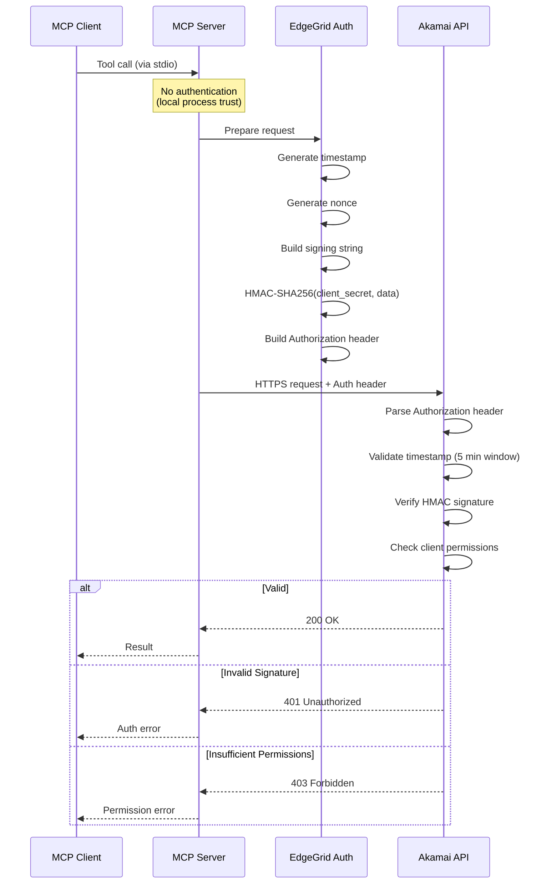

# Security Architecture

## Akamai MCP Server - Threat Model and Security Controls

**Document Version**: 1.0
**Last Updated**: 2026-01-15
**Classification**: Internal
**Framework**: STRIDE, NIST CSF

---

## Threat Model Summary

### Key Assets

| Asset | Classification | Impact if Compromised |
|-------|---------------|----------------------|
| API Credentials | Confidential | Full Akamai account access |
| Configuration | Internal | Service disruption |
| Operation Registry | Internal | Service disruption |
| Audit Logs | Internal | Loss of accountability |
| CDN Configurations | Internal | Service impact, security bypass |

### Primary Adversaries

| Adversary | Motivation | Capability | Target |
|-----------|-----------|------------|--------|
| Malicious Insider | Data theft, sabotage | High | Credentials, configurations |
| External Attacker | CDN compromise | Medium | Credential theft, service abuse |
| Compromised Client | Lateral movement | Medium | API access |
| Supply Chain | Code injection | Low-Medium | Dependencies |

### Attack Surface

```
┌─────────────────────────────────────────────────────────────────┐
│ Attack Surface Map                                               │
└─────────────────────────────────────────────────────────────────┘

EXTERNAL INTERFACES
├── stdio (MCP Protocol)
│   └── Attack vectors: Malicious input, JSON injection
│   └── Controls: Input validation, schema enforcement
│
├── File System (.env, logs)
│   └── Attack vectors: Credential theft, log injection
│   └── Controls: File permissions, structured logging
│
└── Network (Akamai APIs)
    └── Attack vectors: MITM, replay attacks
    └── Controls: TLS 1.2+, HMAC signing

INTERNAL COMPONENTS
├── Dependencies (npm packages)
│   └── Attack vectors: Supply chain compromise
│   └── Controls: Lock files, audit, minimal dependencies
│
└── Process Memory
    └── Attack vectors: Memory dump, debugging
    └── Controls: No credential persistence, process isolation
```

---

## STRIDE Threat Analysis

### Spoofing

**Threat**: Attacker impersonates legitimate MCP client or Akamai API

```
┌─────────────────────────────────────────────────────────────────┐
│ Spoofing Threats                                                 │
├─────────────────────────────────────────────────────────────────┤
│ S1: Malicious MCP Client                                        │
│     Risk: Medium                                                 │
│     Impact: Unauthorized API operations                          │
│     Mitigation: Process-level trust (stdio local only)          │
│                                                                  │
│ S2: Fake Akamai API Response                                    │
│     Risk: Low                                                    │
│     Impact: Data manipulation                                   │
│     Mitigation: TLS certificate validation, HTTPS only          │
└─────────────────────────────────────────────────────────────────┘
```

**Mitigations**:
- stdio transport is local-only (no network spoofing)
- TLS certificate validation for Akamai APIs
- No anonymous API access (EdgeGrid required)

### Tampering

**Threat**: Attacker modifies requests, responses, or configuration

```
┌─────────────────────────────────────────────────────────────────┐
│ Tampering Threats                                                │
├─────────────────────────────────────────────────────────────────┤
│ T1: Request Modification in Transit                             │
│     Risk: Very Low                                              │
│     Impact: Unauthorized configuration changes                   │
│     Mitigation: HMAC-SHA256 signing, TLS encryption             │
│                                                                  │
│ T2: Configuration File Tampering                                │
│     Risk: Medium                                                 │
│     Impact: Credential theft, misconfiguration                  │
│     Mitigation: File permissions, integrity monitoring          │
│                                                                  │
│ T3: Log Tampering                                               │
│     Risk: Low                                                    │
│     Impact: Loss of audit trail                                 │
│     Mitigation: Structured logging, log shipping                │
└─────────────────────────────────────────────────────────────────┘
```

**Mitigations**:
- HMAC-SHA256 request signing (detects tampering)
- TLS encryption (prevents MITM)
- File permission recommendations

### Repudiation

**Threat**: User denies performing operations

```
┌─────────────────────────────────────────────────────────────────┐
│ Repudiation Threats                                              │
├─────────────────────────────────────────────────────────────────┤
│ R1: Denial of API Operations                                    │
│     Risk: Low                                                    │
│     Impact: Accountability issues                               │
│     Mitigation: Comprehensive audit logging, timestamps         │
│                                                                  │
│ R2: Missing Audit Trail                                         │
│     Risk: Medium                                                 │
│     Impact: Cannot trace actions to source                      │
│     Mitigation: Request IDs, correlation, log retention         │
└─────────────────────────────────────────────────────────────────┘
```

**Mitigations**:
- Comprehensive audit logging
- Timestamped operations with request IDs
- HMAC signatures include nonce (uniqueness)
- Akamai-side audit logs

### Information Disclosure

**Threat**: Sensitive data exposed to unauthorized parties

```
┌─────────────────────────────────────────────────────────────────┐
│ Information Disclosure Threats                                   │
├─────────────────────────────────────────────────────────────────┤
│ I1: Credential Leakage in Logs                                  │
│     Risk: Medium                                                 │
│     Impact: Account compromise                                  │
│     Mitigation: Never log credentials, redaction                │
│                                                                  │
│ I2: Memory Dump Credential Exposure                             │
│     Risk: Low                                                    │
│     Impact: Account compromise                                  │
│     Mitigation: Process isolation, no persistence               │
│                                                                  │
│ I3: Error Message Leakage                                       │
│     Risk: Low                                                    │
│     Impact: System information exposure                         │
│     Mitigation: Sanitized error messages                        │
└─────────────────────────────────────────────────────────────────┘
```

**Mitigations**:
- Credentials never logged
- Partial host redaction in logs
- Structured error responses (no stack traces to client)
- Process isolation

### Denial of Service

**Threat**: Service unavailability through resource exhaustion

```
┌─────────────────────────────────────────────────────────────────┐
│ Denial of Service Threats                                        │
├─────────────────────────────────────────────────────────────────┤
│ D1: Rate Limit Exhaustion                                       │
│     Risk: Medium                                                 │
│     Impact: Blocked API access                                  │
│     Mitigation: Client-side rate limiting                       │
│                                                                  │
│ D2: Memory Exhaustion via Large Responses                       │
│     Risk: Low                                                    │
│     Impact: Process crash                                       │
│     Mitigation: Response size limits, pagination                │
│                                                                  │
│ D3: Slow Request Attacks                                        │
│     Risk: Low                                                    │
│     Impact: Resource starvation                                 │
│     Mitigation: Request timeouts                                │
└─────────────────────────────────────────────────────────────────┘
```

**Mitigations**:
- Client-side rate limiting (20 req/s)
- Request timeouts (30s default)
- Exponential backoff on errors
- Circuit breaker pattern

### Elevation of Privilege

**Threat**: Gaining unauthorized access or permissions

```
┌─────────────────────────────────────────────────────────────────┐
│ Elevation of Privilege Threats                                   │
├─────────────────────────────────────────────────────────────────┤
│ E1: API Permission Abuse                                        │
│     Risk: Medium                                                 │
│     Impact: Unauthorized operations                             │
│     Mitigation: Least privilege API client                      │
│                                                                  │
│ E2: Header Injection                                            │
│     Risk: Low                                                    │
│     Impact: Auth bypass, impersonation                          │
│     Mitigation: Header allowlist                                │
│                                                                  │
│ E3: Path Traversal                                              │
│     Risk: Very Low                                              │
│     Impact: Access to unintended resources                      │
│     Mitigation: Path parameter encoding                         │
└─────────────────────────────────────────────────────────────────┘
```

**Mitigations**:
- Header allowlist (only safe headers forwarded)
- Path parameter encoding
- API client permission enforcement (Akamai-side)
- No privilege escalation path in code

---

## Security Controls

### Control Matrix

| ID | Control | Type | Implementation | Effectiveness |
|----|---------|------|----------------|---------------|
| SC-001 | Input Validation | Preventive | Zod schema validation | High |
| SC-002 | Output Encoding | Preventive | JSON serialization | High |
| SC-003 | HMAC Authentication | Preventive | EdgeGrid library | Very High |
| SC-004 | TLS Encryption | Preventive | Node.js HTTPS | Very High |
| SC-005 | Rate Limiting | Preventive | Token bucket | High |
| SC-006 | Request Timeout | Preventive | 30s default | Medium |
| SC-007 | Header Allowlist | Preventive | Custom filter | High |
| SC-008 | Audit Logging | Detective | Winston logger | High |
| SC-009 | Error Logging | Detective | Exception capture | High |
| SC-010 | Health Monitoring | Detective | Health checks | Medium |
| SC-011 | Circuit Breaker | Recovery | State machine | High |
| SC-012 | Retry with Backoff | Recovery | Exponential | High |
| SC-013 | Graceful Shutdown | Recovery | SIGINT handler | High |

### Header Allowlist (SC-007)

```typescript
// src/executor/universal-executor.ts:196-216
const allowedHeaders = [
  'accept',
  'content-type',
  'if-match',
  'if-none-match',
  'prefer',
  'x-request-id',
  'papi-use-prefixes',
  'x-akamai-contract',
  'x-akamai-group',
  'x-akamai-purge',
  'akamai-signature-algorithm'
];

// Rejected headers are logged as warnings
// Never forwarded to Akamai APIs
```

**Rationale**: Prevents injection of dangerous headers like `Authorization`, `Host`, `X-Forwarded-For` that could bypass security controls.

### Credential Protection

```
┌─────────────────────────────────────────────────────────────────┐
│ Credential Protection Implementation                             │
└─────────────────────────────────────────────────────────────────┘

1. STORAGE
   ├── Environment variables (AKAMAI_HOST, etc.)
   ├── .edgerc file (~/.edgerc)
   ├── File permissions: chmod 600
   └── .gitignore includes .env, .edgerc

2. LOADING
   ├── Load once at startup
   ├── Validate structure (Zod schema)
   ├── Store in singleton instance
   └── Fail fast if invalid

3. USAGE
   ├── HMAC signing only (never raw transmission)
   ├── EdgeGrid library handles signing
   └── No credential concatenation to strings

4. LOGGING
   ├── host: Partial redaction (akab-xxx...)
   ├── client_token: NEVER logged
   ├── client_secret: NEVER logged
   ├── access_token: NEVER logged
   └── HMAC signature: NEVER logged
```

---

## Authentication and Authorization

### Authentication Flow



### Authorization Model

```
┌─────────────────────────────────────────────────────────────────┐
│ Authorization Hierarchy                                          │
└─────────────────────────────────────────────────────────────────┘

[Akamai Account Owner]
         │
         │ Creates API Client (Akamai Control Center)
         │
         ▼
[API Client Credentials]
         │
         │ Assigned Permissions:
         │  • Property Manager: READ/WRITE
         │  • Fast Purge: READ/WRITE
         │  • EdgeWorkers: READ/WRITE
         │  • DNS: READ/WRITE
         │  • Security: READ/WRITE
         │
         ▼
[MCP Server]
         │
         │ Uses credentials for all operations
         │ NO additional authorization layer
         │ Inherits API client permissions
         │
         ▼
[Akamai Platform]
         │
         │ Enforces permissions per operation
         │ Rate limiting per client
         │ Audit logging per client
```

**Note**: The MCP server does not implement its own authorization layer. All permission enforcement is delegated to Akamai's API platform. Users should configure API clients with minimum required permissions.

---

## Data Protection

### Data Classification

| Data Type | Classification | At Rest | In Transit | In Memory |
|-----------|---------------|---------|------------|-----------|
| API Credentials | Confidential | chmod 600 | N/A | Process only |
| Configuration | Internal | chmod 640 | N/A | Process only |
| API Requests | Internal | N/A | TLS 1.2+ | Transient |
| API Responses | Internal | N/A | TLS 1.2+ | Transient |
| Audit Logs | Internal | chmod 640 | N/A | Buffer only |
| Cache Data | Internal | N/A | N/A | LRU cache |

### Encryption Standards

| Purpose | Algorithm | Key Length | Standard |
|---------|-----------|-----------|----------|
| Request Signing | HMAC-SHA256 | 256-bit | RFC 2104 |
| Transport | TLS 1.2+ | 2048-bit RSA | RFC 5246 |
| Content Hashing | SHA-256 | 256-bit | FIPS 180-4 |

---

## Network Security

### Network Architecture

```
┌─────────────────────────────────────────────────────────────────┐
│ Network Security Zones                                           │
└─────────────────────────────────────────────────────────────────┘

Zone: LOCAL (Trusted)
┌─────────────────────────────────────────────────────────────────┐
│ MCP Client ◄──── stdio (IPC) ────► MCP Server                   │
│                                                                  │
│ • No network exposure                                           │
│ • Process-level isolation                                       │
│ • OS permissions                                                │
└─────────────────────────────────────────────────────────────────┘
                            │
                            │ Egress only (HTTPS 443)
                            │ TLS 1.2+ required
                            ▼
Zone: INTERNET (Untrusted)
┌─────────────────────────────────────────────────────────────────┐
│ TLS Encrypted Tunnel                                            │
│ • Certificate validation                                        │
│ • Strong cipher suites                                          │
│ • Perfect forward secrecy                                       │
└─────────────────────────────────────────────────────────────────┘
                            │
                            ▼
Zone: AKAMAI (Semi-Trusted)
┌─────────────────────────────────────────────────────────────────┐
│ Akamai EdgeGrid APIs                                            │
│ • *.luna.akamaiapis.net                                         │
│ • Load balanced                                                 │
│ • DDoS protected                                                │
│ • Per-client rate limiting                                      │
└─────────────────────────────────────────────────────────────────┘
```

### Firewall Recommendations

```bash
# Egress rules (allow)
-A OUTPUT -p tcp --dport 443 -d *.luna.akamaiapis.net -j ACCEPT
-A OUTPUT -p udp --dport 53 -j ACCEPT  # DNS

# Ingress rules (deny all - no inbound required)
-A INPUT -j DROP
```

---

## Security Monitoring

### Audit Events

| Event | Severity | Logging | Alerting |
|-------|----------|---------|----------|
| Server startup | INFO | Always | No |
| Tool call | INFO | Always | No |
| API request | INFO | Always | No |
| 401 Unauthorized | HIGH | Always | Yes |
| 403 Forbidden | HIGH | Always | Yes |
| 429 Rate limited | MEDIUM | Always | Threshold |
| Network error | LOW | Always | No |
| Process crash | CRITICAL | Always | Yes |

### Security Metrics

```typescript
// Recommended metrics to track
{
  "security": {
    "auth_failures": count,        // 401/403 responses
    "rate_limit_hits": count,      // 429 responses
    "circuit_breaker_opens": count, // Circuit breaker trips
    "invalid_headers_blocked": count // Rejected headers
  }
}
```

---

## Compliance Mapping

### NIST Cybersecurity Framework

| Function | Category | Implementation |
|----------|----------|---------------|
| IDENTIFY | Asset Management | Documentation |
| IDENTIFY | Risk Assessment | STRIDE analysis |
| PROTECT | Access Control | EdgeGrid auth |
| PROTECT | Data Security | TLS, HMAC |
| PROTECT | Protective Technology | Input validation |
| DETECT | Monitoring | Audit logging |
| RESPOND | Response Planning | Error handling |
| RECOVER | Recovery Planning | Retry, circuit breaker |

### Security Baseline

```bash
# File permissions
chmod 600 .env .edgerc          # Credentials
chmod 640 logs/*.log            # Logs
chmod 750 dist/                 # Code

# Environment
export NODE_ENV=production
export LOG_LEVEL=info

# Process
User=akamai-mcp                 # Non-root
NoNewPrivileges=true            # No escalation
PrivateTmp=true                 # Isolated temp
```

---

## Incident Response

### Credential Compromise Procedure

1. **Immediate** (0-5 min): Revoke credentials in Akamai Control Center
2. **Containment** (5-30 min): Review recent operations, preserve logs
3. **Eradication** (30-60 min): Generate new credentials, redeploy
4. **Recovery** (1-4 hrs): Verify services, monitor for anomalies
5. **Lessons Learned** (1-7 days): Root cause analysis, improve controls

---

## Open Questions and Gaps

1. **API client permission audit** - No automated verification that API client has minimum permissions
2. **Credential rotation** - Manual process; consider automated rotation
3. **Runtime application self-protection** - No RASP integration
4. **Security scanning in CI** - Recommend adding SAST/SCA to pipeline

---

*Generated: 2026-01-15*
