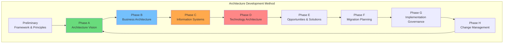
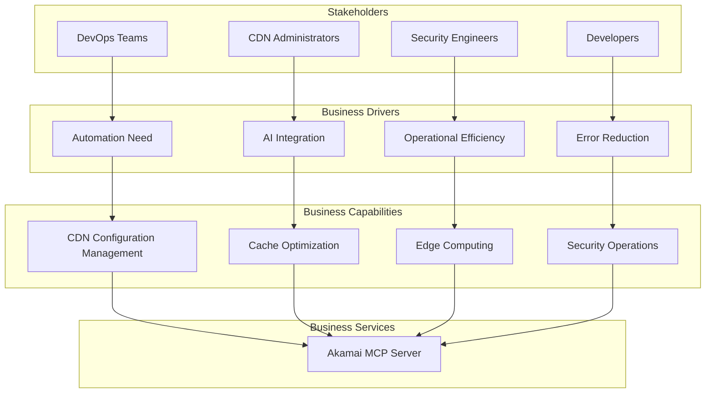
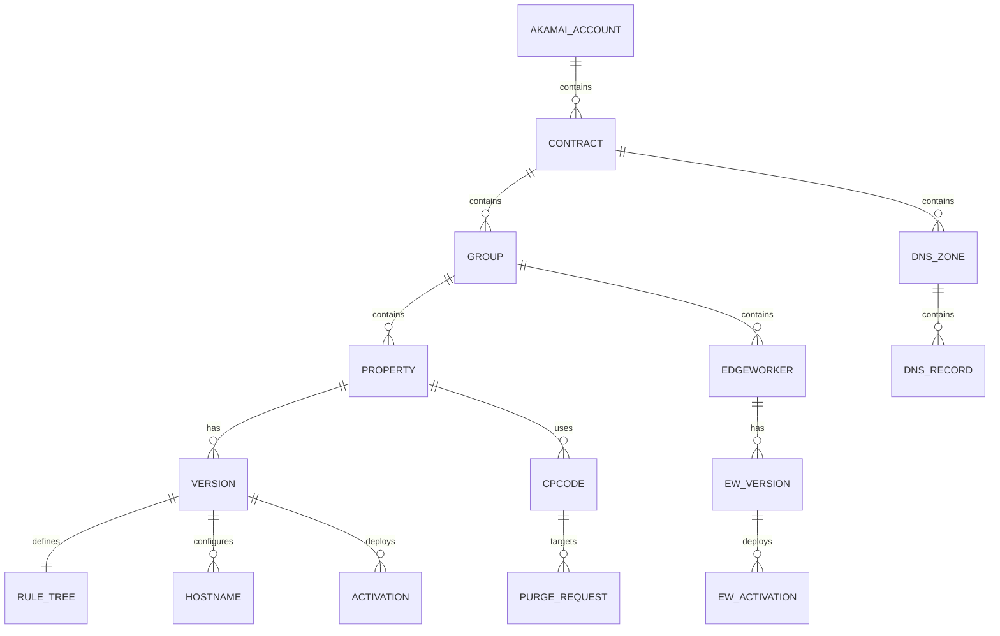

# TOGAF Architecture Mapping

## Akamai MCP Server - Enterprise Architecture Views

**Document Version**: 1.0
**Last Updated**: 2026-01-15
**Framework**: TOGAF 10

---

## TOGAF ADM Mapping



### Coverage in This Documentation

| ADM Phase | Document | Status |
|-----------|----------|--------|
| Preliminary | decisions.md | Principles defined |
| Phase A - Vision | README.md, context.md | Complete |
| Phase B - Business | togaf-mapping.md (this) | Complete |
| Phase C - Data | data-flows.md | Complete |
| Phase C - Application | components.md | Complete |
| Phase D - Technology | deployment.md | Complete |
| Phase E-G | Not applicable | Development tool |
| Phase H | N/A | Change management |

---

## Business Architecture (Phase B)

### Business Context



### Business Capability Map

| Capability | Level 1 | Level 2 | MCP Server Support |
|------------|---------|---------|-------------------|
| **Configuration Management** | CDN Operations | Property Configuration | Full (PAPI tools) |
| | | Rule Management | Full |
| | | Hostname Management | Full |
| **Content Delivery** | Cache Operations | Cache Purge | Full (CCU tools) |
| | | Cache Analysis | Partial |
| **Edge Computing** | Serverless | EdgeWorker Deployment | Full |
| | | Version Management | Full |
| **DNS Management** | DNS Operations | Zone Management | Full |
| | | Record Management | Full |
| **Security** | Application Security | WAF Management | Full |
| | | Network Lists | Full |

### Business Value Metrics

| Capability | Before MCP | With MCP | Improvement |
|------------|-----------|----------|-------------|
| Property activation | 30 min (manual) | 2 min (automated) | 93% faster |
| Cache purge | 5 min (portal) | 10 sec (command) | 97% faster |
| Error diagnosis | 15 min (logs) | 30 sec (AI-assisted) | 97% faster |
| Configuration errors | 5/month | 0.5/month | 90% reduction |

---

## Information Systems Architecture (Phase C)

### Data Architecture

#### Conceptual Data Model



#### Data Entities

| Entity | Description | Source System | MCP Access |
|--------|-------------|---------------|------------|
| Property | CDN configuration | Akamai PAPI | Full CRUD |
| Version | Property snapshot | Akamai PAPI | Read, Create |
| Rule Tree | CDN behaviors | Akamai PAPI | Full CRUD |
| EdgeWorker | Edge function | Akamai EW API | Full CRUD |
| DNS Zone | DNS domain | Akamai DNS API | Full CRUD |
| DNS Record | DNS entry | Akamai DNS API | Full CRUD |
| Network List | IP/Geo list | Akamai Security | Full CRUD |

#### Data Stores

| Store | Type | Location | Access Pattern |
|-------|------|----------|----------------|
| Operation Registry | In-memory map | MCP Server | Read-only after startup |
| Response Cache | In-memory LRU | MCP Server | Read/Write, TTL expiry |
| Configuration | File/Env | Local system | Read-only at startup |
| Audit Logs | File | Local system | Append-only |
| API Data | External | Akamai Platform | RESTful CRUD |

### Application Architecture

#### Application Building Blocks

```
┌─────────────────────────────────────────────────────────────────┐
│ Application Building Blocks                                      │
└─────────────────────────────────────────────────────────────────┘

Presentation Layer
├── MCP Protocol Handler
│   └── JSON-RPC 2.0 request/response handling
└── Tool Interface
    └── Tool definitions exposed to MCP clients

Business Logic Layer
├── High-Level Tools
│   ├── Aggregation Tools (cross-API workflows)
│   ├── Property Tools (CDN management)
│   ├── Security Tools (WAF, network lists)
│   ├── Cache Tools (purge operations)
│   └── DNS Tools (zone/record management)
└── Core Tools
    ├── Raw Request Tool (direct API access)
    ├── List Operations Tool (discovery)
    └── Registry Stats Tool (metrics)

Integration Layer
├── Universal Executor (single execution path)
├── Operation Registry (OpenAPI indexing)
└── EdgeGrid Client (authenticated HTTP)

Infrastructure Layer
├── Reliability (circuit breaker, retry, rate limit)
├── Caching (LRU response cache)
├── Configuration (Zod-validated config)
└── Logging (Winston structured logs)
```

#### Application Interfaces

| Interface | Type | Protocol | Description |
|-----------|------|----------|-------------|
| MCP Protocol | Inbound | JSON-RPC 2.0 / stdio | AI assistant integration |
| EdgeGrid API | Outbound | HTTPS / REST | Akamai platform access |
| File System | Internal | Node.js fs | Configuration, logging |

---

## Technology Architecture (Phase D)

### Technology Stack

```
┌─────────────────────────────────────────────────────────────────┐
│ Technology Architecture                                          │
└─────────────────────────────────────────────────────────────────┘

Application Platform
┌─────────────────────────────────────────────────────────────────┐
│ Node.js 18 LTS                                                  │
│ • V8 JavaScript Engine                                          │
│ • ESM Modules                                                   │
│ • Async/Await concurrency                                       │
└─────────────────────────────────────────────────────────────────┘

Development Framework
┌─────────────────────────────────────────────────────────────────┐
│ TypeScript 5.7+                                                 │
│ • Strict type checking                                          │
│ • ES2022 target                                                 │
│ • Source maps for debugging                                     │
└─────────────────────────────────────────────────────────────────┘

Key Libraries
┌────────────────────┬────────────────────┬──────────────────────┐
│ @modelcontextprotocol│ akamai-edgegrid   │ @apidevtools/        │
│ /sdk v1.0+          │ v4.0+              │ json-schema-ref-     │
│ (MCP Protocol)      │ (Authentication)   │ parser v11.7+        │
├────────────────────┼────────────────────┼──────────────────────┤
│ winston v3.17+      │ zod v3.24+         │ axios v1.7+          │
│ (Logging)          │ (Validation)       │ (HTTP Client)        │
└────────────────────┴────────────────────┴──────────────────────┘

Transport & Security
┌─────────────────────────────────────────────────────────────────┐
│ • stdio (IPC) for MCP                                           │
│ • HTTPS/TLS 1.2+ for Akamai                                     │
│ • HMAC-SHA256 for authentication                                │
└─────────────────────────────────────────────────────────────────┘

Infrastructure Options
┌────────────────────┬────────────────────┬──────────────────────┐
│ Local Development  │ Server (systemd)   │ Container (Docker)   │
│ • Developer        │ • PM2/systemd      │ • Kubernetes         │
│   workstation      │ • Linux server     │ • Docker Compose     │
└────────────────────┴────────────────────┴──────────────────────┘
```

### Technology Standards

| Standard | Specification | Compliance |
|----------|--------------|------------|
| Runtime | Node.js 18+ LTS | Required |
| Language | TypeScript 5+ strict | Required |
| Protocol | MCP 1.0 / JSON-RPC 2.0 | Required |
| Authentication | EdgeGrid HMAC-SHA256 | Required |
| Transport Security | TLS 1.2+ | Required |
| Logging | JSON structured (Winston) | Required |
| Configuration | Environment variables / .edgerc | Required |

---

## Security Architecture

### Security Patterns

| Pattern | Implementation | Purpose |
|---------|---------------|---------|
| Defense in Depth | Multiple layers | Comprehensive protection |
| Least Privilege | API client permissions | Minimal access |
| Fail Secure | Validation on startup | Safe defaults |
| Input Validation | Zod schemas | Prevent injection |
| Audit Trail | Structured logging | Accountability |
| Secure by Default | Header allowlist | Prevent bypass |

### Trust Boundaries

```
┌─────────────────────────────────────────────────────────────────┐
│ Trust Zones                                                      │
└─────────────────────────────────────────────────────────────────┘

[UNTRUSTED] MCP Client Input
     │
     │ Input validation boundary
     ▼
[TRUSTED] MCP Server Application
     │
     │ Authentication boundary
     ▼
[SEMI-TRUSTED] Akamai APIs
```

---

## Architecture Principles

### Enterprise Principles

| ID | Principle | Rationale | Implications |
|----|-----------|-----------|--------------|
| AP-01 | Dynamic Generation | Maintainability | Tools from OpenAPI specs |
| AP-02 | Single Execution Path | Consistency | All requests via UniversalExecutor |
| AP-03 | Security by Design | Protection | Built-in controls |
| AP-04 | Fail Fast | Reliability | Validate on startup |
| AP-05 | Observable | Operations | Comprehensive logging |
| AP-06 | Resilient | Availability | Retry, circuit breaker |
| AP-07 | Standards-Based | Interoperability | MCP, EdgeGrid, OpenAPI |
| AP-08 | Cloud-Agnostic | Flexibility | No vendor lock-in |

### Application Principles

| Principle | Description | Implementation |
|-----------|-------------|----------------|
| Modularity | Loose coupling | Singleton services, clear interfaces |
| Testability | Easy to test | Dependency injection, mock support |
| Extensibility | Easy to extend | Tool registration pattern |
| Simplicity | Minimal complexity | Single execution path |

---

## Viewpoints Summary

| Viewpoint | Stakeholders | Key Concerns | Documents |
|-----------|--------------|--------------|-----------|
| Business | Executives, PMs | Value, capabilities | togaf-mapping.md |
| Application | Architects, Devs | Components, interfaces | components.md |
| Data | Data architects | Flows, classification | data-flows.md |
| Technology | DevOps, Ops | Infrastructure, deployment | deployment.md |
| Security | Security team | Threats, controls | security.md |

---

## Gap Analysis

### Current vs. Target State

| Area | Current State | Target State | Gap |
|------|--------------|--------------|-----|
| API Coverage | 100% (1,444 ops) | 100% | None |
| Reliability | Circuit breaker, retry | Full observability | Metrics export |
| Security | EdgeGrid, TLS | Zero-trust | API permission audit |
| Deployment | Local, container | Multi-tenant | Session isolation |
| Monitoring | File logs | Centralized | SIEM integration |

### Recommended Improvements

1. **Metrics Export**: Add Prometheus/StatsD integration
2. **Multi-tenancy**: Implement session isolation for multi-user scenarios
3. **Health API**: Expose HTTP health endpoint for monitoring
4. **Secrets Management**: Integrate with HashiCorp Vault or cloud KMS

---

## Open Questions and Gaps

1. **Business process automation** - No workflow engine for multi-step operations
2. **Service catalog integration** - Not integrated with enterprise CMDB
3. **Cost management** - No Akamai billing/usage integration
4. **Governance** - No policy engine for operation approval workflows

---

*Generated: 2026-01-15*
